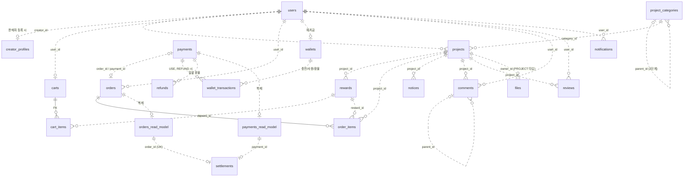
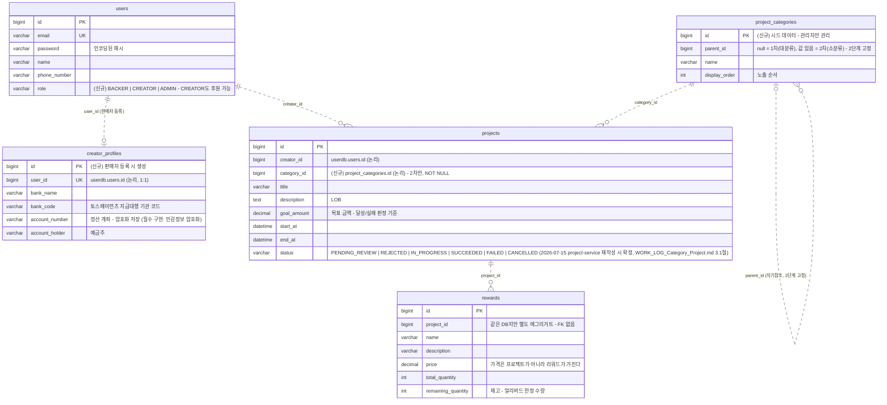
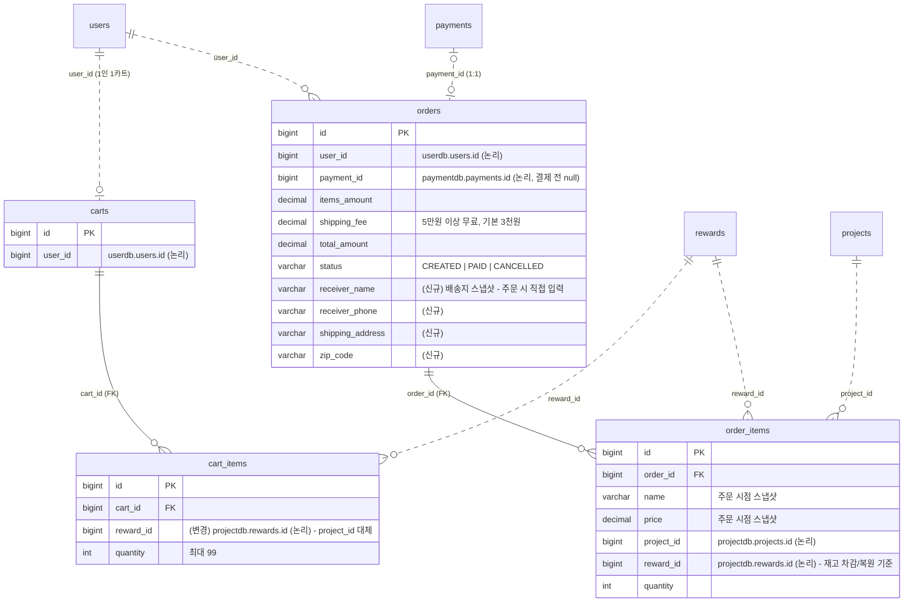
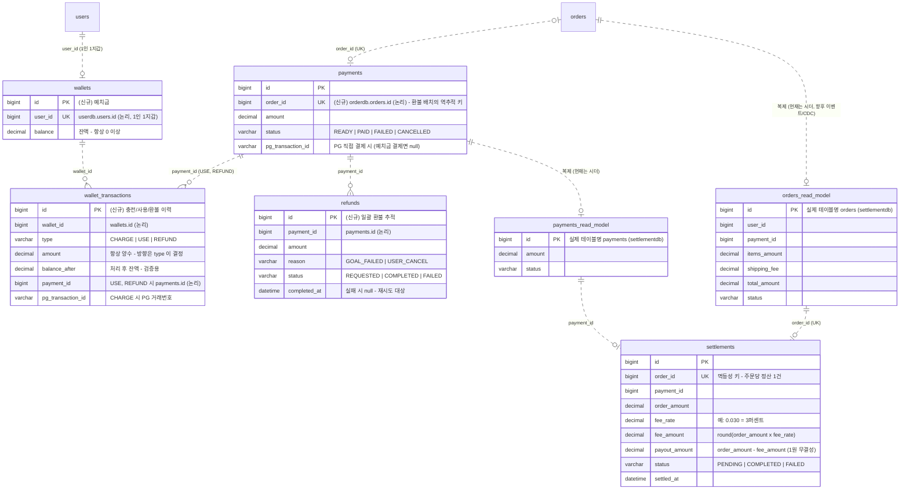
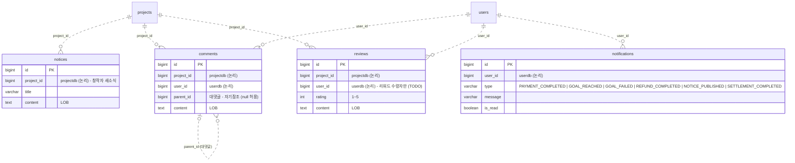
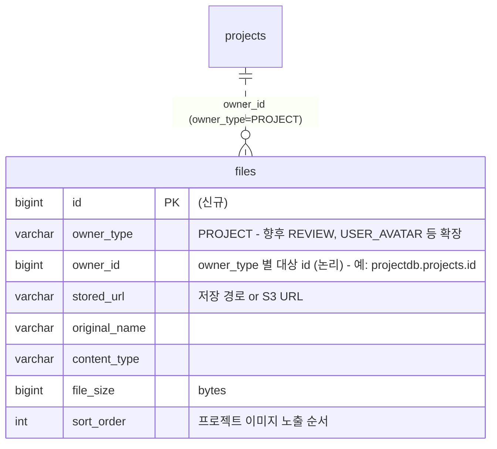

# 얼리버드 ERD (초안 v2 — 설계 확정안)

> 2026-07-15 기준. v1은 **현재 코드가 만들어내는 스키마** 그대로였고, v2는 §6 체크리스트의 결정을 반영한
> **목표 스키마**다. `(신규)` 표시 테이블/컬럼은 아직 코드에 없다 — 구현 백로그는 §6 참고.
>
> **Database per Service**: MySQL 스키마 9개가 물리적으로 분리되어 있다. 서비스 경계를 넘는 참조는
> FK 제약 없이 **ID 값만 저장**한다 (포트/어댑터로 HTTP 조회).
>
> **범례**
>
> - 실선(`──`) : 같은 DB 안의 실제 FK (JPA 연관관계가 생성)
> - 점선(`┈┈`) : ID 논리 참조 (FK 제약 없음 — 같은 DB라도 애그리거트가 다르면 점선)

## 1. 전체 관계 한눈에 (컬럼 생략)

컬럼은 §2 도메인별 상세 ERD 참고.

## 2. 도메인별 상세 ERD

다른 도메인 소속 테이블은 **빈 박스(참조용 스텁)** 로만 표시한다.
공통 규칙: **모든 테이블은 `created_at`/`updated_at` 감사 컬럼을 가진다** (JPA Auditing BaseEntity, §5 참고) —
다이어그램에는 도메인 의미가 있는 시각(`settled_at` 등)만 따로 표기한다.

### 2.1 User + Project (userdb · projectdb)

> - **판매자 등록** = `users.role` 을 CREATOR 로 전환 + `creator_profiles` 생성. role 은 단일 값이며,
>   CREATOR/ADMIN 도 후원(구매) 기능을 전부 쓸 수 있다 (명세서 요구).
> - **`project_categories`**: 대분류/소분류 2단계를 자기참조 한 테이블로. 프로젝트는 **2차(소분류)만**
>   지정(NOT NULL)하고 대분류는 parent 를 따라가서 얻는다. 목록은 시드 데이터로 고정, 관리자만 추가.

### 2.2 Cart + Order (cartdb · orderdb)

> - **장바구니는 reward 단위**: `cart_items.project_id` → `reward_id` 로 교체. 프로젝트 정보(묶음 표시 등)는
>   reward → project 경유 조회. `order_items` 는 정산·환불이 프로젝트 단위라 `project_id` 를 스냅샷으로 유지.
> - **배송지는 주문 스냅샷만**: 주소록 테이블 없이 주문 시 직접 입력 → orders 에 저장. (주소록은 세미프로젝트 범위 밖)

### 2.3 Payment + Wallet + Settlement (paymentdb · settlementdb)

> **돈의 흐름** (예치금은 payment-service 소유 — 결제 승인과 예치금 차감이 한 트랜잭션):
>
> 1. **충전**: PG 결제(테스트 API) 성공 → `wallet_transactions(CHARGE, pg_transaction_id)` + `wallets.balance` 증가
> 2. **주문 결제**: `payments(order_id)` 생성 → `wallet_transactions(USE, payment_id)` + 잔액 차감 → PAID
> 3. **일괄 환불**(GOAL_FAILED): 프로젝트의 주문들 → `payments.order_id` 로 결제 역추적 → `refunds` 생성 →
>    `wallet_transactions(REFUND)` + 잔액 복원 + 리워드 재고 복원. `refunds.status` 로 배치 실패/재시도 추적.

### 2.4 Board + Notification (boarddb · notificationdb)

### 2.5 File (filedb)

> 파일 주인을 `owner_type + owner_id` 다형 참조로 두어, 프로젝트 이미지 외(리뷰 사진 등)로 확장해도
> 테이블 추가가 없다. 당장 쓰는 타입은 PROJECT 하나.

## 3. DB(스키마)별 테이블 소유

| DB | 서비스 | 테이블 | 비고 |
| --- | --- | --- | --- |
| `userdb` | user-service :8083 | `users`, `creator_profiles`(신규) | role 컬럼 추가 / 계좌는 암호화 |
| `projectdb` | project-service :8081 | `projects`, `rewards`, `project_categories`(신규) | 리워드가 가격·재고 보유 / 카테고리 2단계 |
| `cartdb` | cart-service :8085 | `carts`, `cart_items` | reward_id 기준으로 변경 |
| `orderdb` | order-service :8080 | `orders`, `order_items` | 가격·이름·배송지는 주문 시점 스냅샷 |
| `paymentdb` | payment-service :8082 | `payments`, `wallets`(신규), `wallet_transactions`(신규), `refunds`(신규) | 예치금 + PG 연동 + 환불 추적 |
| `settlementdb` | settlement-service :8086 | `orders`(read), `payments`(read), `settlements` | 배치 전용 read-model |
| `boarddb` | board-service | `notices`, `comments`, `reviews` | 커뮤니티 3분해 |
| `notificationdb` | notification-service | `notifications` | type enum 확정 |
| `filedb` | file-service :8087 | `files`(신규) | owner_type 다형 참조 |

## 4. 설계 포인트 (이미 코드에 반영된 결정)

- **주문 스냅샷**: `order_items` 는 리워드의 `name`/`price` 를 주문 시점 값으로 복사해 보관 — 이후 리워드가 수정돼도 주문 금액이 변하지 않는다.
- **정산 멱등성**: `settlements.order_id` UNIQUE — 같은 주문이 두 번 정산되지 않는다. `fee_amount + payout_amount = order_amount` 1원 무결성 검증 포함.
- **정산 read-model**: settlementdb 의 `orders`/`payments` 는 orderdb/paymentdb 의 **복제본**(이름만 같은 별개 테이블). 현재는 시더가 적재하며, 실제 연동 방식(이벤트 vs 조회 API 페이징)은 팀 결정 필요.
- **BATCH_* 메타테이블 없음**: Spring Batch 6(Boot 4)는 기본이 비영속 job repository — settlementdb 에 BATCH 테이블이 생기지 않는 게 정상. 재시작 내성(배치 중단 후 이어가기)이 필요해지면 JDBC job repository 를 명시 설정해야 한다.

## 5. 새로 확정한 공통 규칙 (v2)

- **감사 컬럼 통일**: 모든 테이블에 `created_at`/`updated_at` — `common` 모듈에 JPA Auditing BaseEntity 를 두고 전 엔티티가 상속. 기존 엔티티의 수동 `created_at` 필드는 BaseEntity 로 이관.
- **금액은 전부 `decimal`**(BigDecimal), 수수료·잔액 계산은 정산의 "1원 무결성" 원칙을 따른다 (`wallet_transactions.balance_after` 로 검증 가능).
- **enum 은 `varchar` 저장** (`@Enumerated(EnumType.STRING)`) — 기존 컨벤션 유지.
- **민감정보 암호화**(필수 구현): `creator_profiles.account_number` 가 첫 대상. 암호화 방식(AES + 키 관리)은 구현 시 결정.

## 6. 체크리스트 결과 — 결정 사항과 구현 백로그

| # | 항목 | 결정 | ERD 반영 |
| --- | --- | --- | --- |
| 1 | `users.role` | 단일 enum `BACKER \| CREATOR \| ADMIN`, CREATOR 도 구매 가능 | §2.1 |
| 2 | 예치금 | **payment-service 소유** — `wallets` + `wallet_transactions` (결제·차감 원자성) | §2.3 |
| 3 | 판매자 등록 | `users.role` 전환 + userdb `creator_profiles`(정산 계좌, 암호화) | §2.1 |
| 4 | 장바구니 reward 단위 | `cart_items.project_id` → **`reward_id` 만** (프로젝트는 경유 조회) | §2.2 |
| 5 | payments → 주문 역참조 | `payments.order_id` (UNIQUE) 추가 — 환불 배치 역추적 키 | §2.3 |
| 6 | 환불 이력 | paymentdb `refunds` (reason/status 로 일괄 환불 추적·재시도) | §2.3 |
| 7 | files | filedb `files` — `owner_type + owner_id` 다형 참조 | §2.5 |
| 8 | 배송지 | **주문 스냅샷만** — orders 에 수령인/연락처/주소/우편번호 (주소록 없음) | §2.2 |
| 9 | 감사 컬럼 | BaseEntity(JPA Auditing) 로 전 테이블 `created_at`/`updated_at` 통일 | §5 |
| 10 | 알림 type | `PAYMENT_COMPLETED \| GOAL_REACHED \| GOAL_FAILED \| REFUND_COMPLETED \| NOTICE_PUBLISHED \| SETTLEMENT_COMPLETED` | §2.4 |
| 11 | 카테고리 세부 | 시드 고정(관리자만 추가) · `category_id` NOT NULL · 2차(소분류)만 지정 | §2.1 |

**구현 백로그** (ERD 에만 있고 코드에 없는 것): `users.role`, `creator_profiles`, `project_categories`,
`projects.category_id`, `cart_items.reward_id` 전환, orders 배송지 컬럼, `payments.order_id`,
`wallets`/`wallet_transactions`/`refunds`, `files`, BaseEntity 감사 컬럼.

**남은 팀 논의**: 정산 read-model 연동 방식(이벤트 vs API 페이징), 리뷰 작성 자격 검증(리워드 수령 확인),
대댓글 깊이 제한, 민감정보 암호화 방식.
