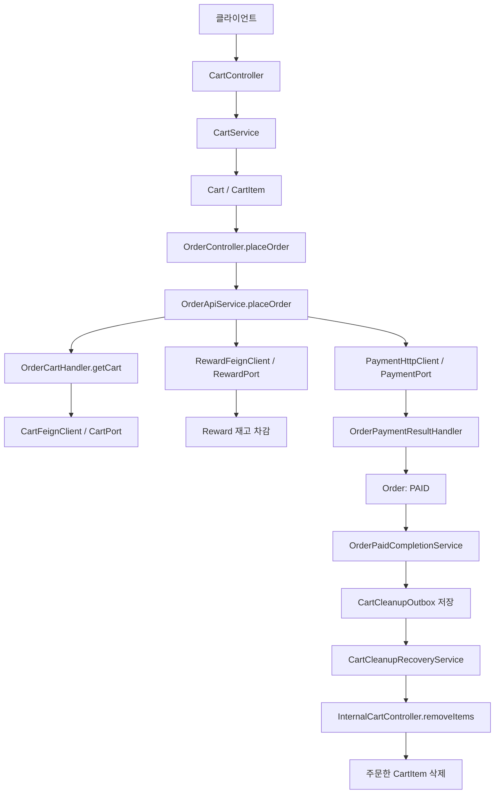
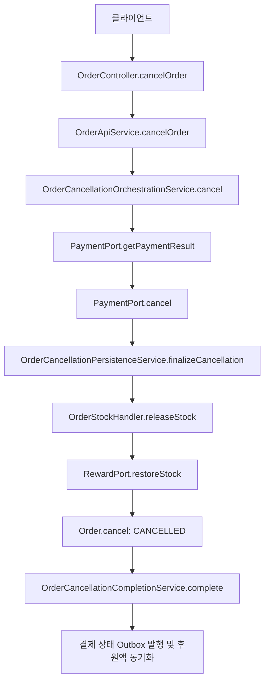
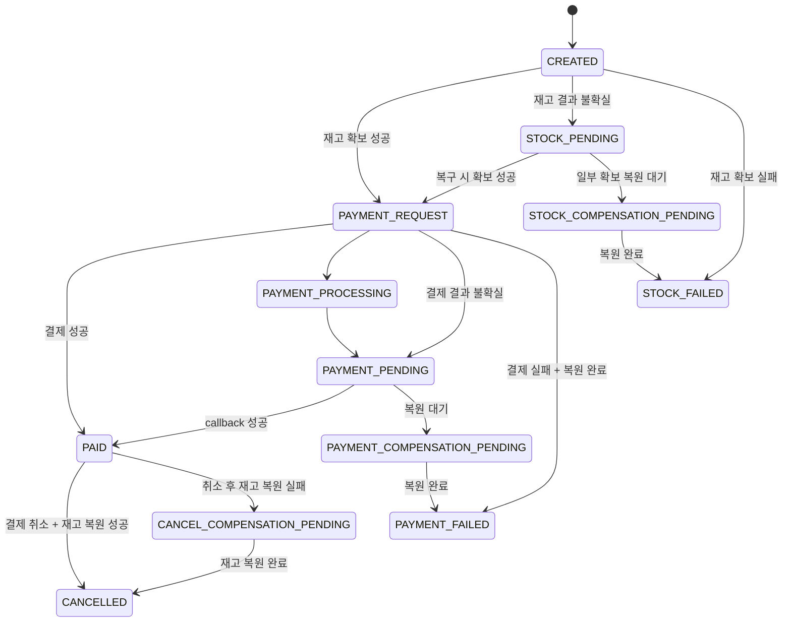
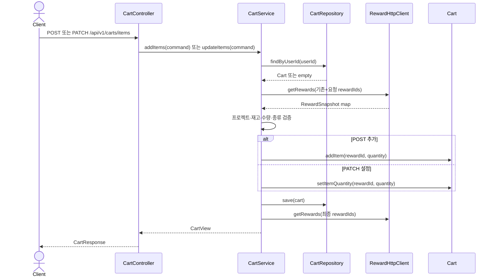
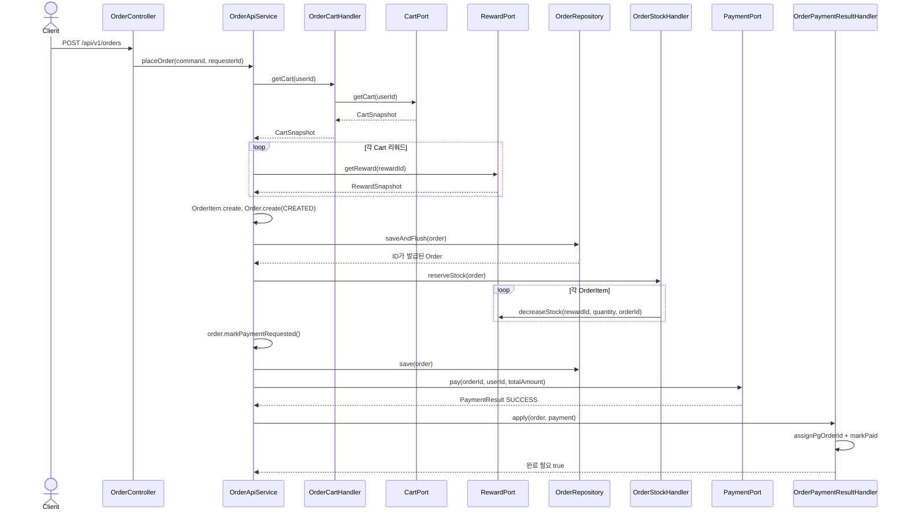
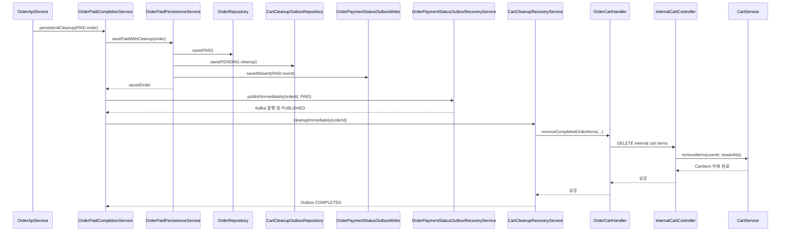
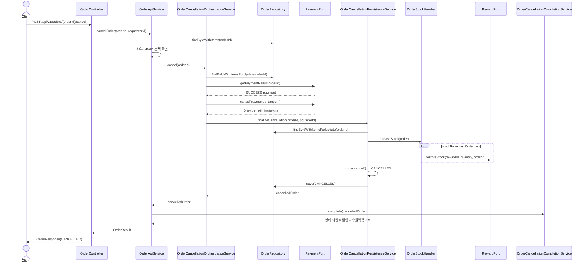

# Cart / Order 도메인 설명서

## 1. 문서 목적과 분석 기준

이 문서는 처음 저장소를 보는 개발자가 장바구니에 리워드를 담는 순간부터 주문 생성, 재고 확보, 결제, 장바구니 정리, 주문 취소까지의 현재 구현을 하나의 시스템으로 이해하도록 돕는 코드 안내서다.


## 2. Cart / Order 전체 개요

### 2.1 책임과 소유권

| 영역 | 실제로 소유하는 것 | 이 구현에서 하지 않는 것 |
|---|---|---|
| Cart | 사용자별 주문 전 선택 목록, 리워드별 희망 수량 | 확정 주문, 결제 상태, 실제 재고 차감 |
| Order | 주문 스냅샷, 배송 정보, 주문 금액, 주문 생명주기와 상태 | Reward의 실제 재고 저장, Payment의 실제 결제 원장 |
| Reward/Project | 리워드 정보와 판매 가능 여부, 실제 재고, 프로젝트 누적 후원액 | 주문 상태 결정 |
| Payment | 실제 결제와 취소, `paymentId` 및 `pgOrderId`, 결제 상태 | 주문 품목과 배송 정보 |

Cart와 Order를 분리하는 가장 중요한 이유는 데이터의 시간적 의미가 다르기 때문이다. Cart는 언제든 바뀌는 구매 의사다. 반면 Order는 결제 시점의 이름, 가격, 수량, 프로젝트, 배송지, 금액을 이후에도 그대로 설명해야 하는 거래 기록이다. 그래서 Order는 Cart 행을 외래 키로 계속 참조하지 않고 Reward를 다시 검증한 뒤 `OrderItem`에 스냅샷을 복사한다. 여기서 스냅샷은 “그 시점의 값을 주문 자체에 고정해 저장한 사본”이라는 뜻이다.

### 2.2 Cart가 Order의 원천이 되는 방법

클라이언트는 주문 요청에 리워드 목록과 예상 단가를 보낸다. 그러나 `OrderApiService.commandFromCart(...)`는 이 목록을 그대로 주문하지 않는다.

1. `CartPort`로 사용자의 현재 Cart 스냅샷을 조회한다.
2. 요청의 리워드 집합과 Cart의 리워드 집합이 정확히 같은지 검사한다.
3. 실제 주문 수량은 Cart의 수량으로 다시 구성한다.
4. 요청의 예상 단가는 이후 Reward 현재 가격과 대조하는 값으로만 사용한다.
5. `RewardPort.getReward(...)`로 현재 이름, 가격, 프로젝트, 잔여 수량, 주문 가능 여부를 다시 가져온다.
6. 검증된 값으로 `OrderItem`을 만든다.

즉, Cart는 “무엇을 몇 개 주문할지”의 원천이고, Reward는 “그 리워드가 지금 무엇이며 얼마인지”의 원천이다. Order는 두 정보를 검증해 거래 스냅샷으로 고정한다.

### 2.3 계층과 역할

- Presentation: `CartController`, `OrderController`, 내부 Controller가 HTTP 경로, 헤더, 요청 검증, 응답 변환을 담당한다.
- Application: `CartService`, `OrderApiService`와 세부 완료·오케스트레이션 서비스가 유스케이스 순서를 조정한다. 오케스트레이션은 여러 시스템 작업의 순서를 조율한다는 뜻이다.
- Domain: `Cart`, `CartItem`, `Order`, `OrderItem`이 자체 상태와 불변 조건을 보호한다. 집합체는 함께 일관되게 변경되는 객체 묶음이며, 이 코드에서는 `Cart`가 `CartItem`을, `Order`가 `OrderItem`을 소유하는 루트다.
- Infrastructure: JPA 저장소 어댑터, Feign/HTTP 클라이언트, Kafka 발행·소비 구현이 기술 세부사항을 담당한다.
- Port/Adapter: Port는 Application이 필요로 하는 작업의 인터페이스이고, Adapter는 HTTP·Feign·Kafka·JPA로 그 계약을 구현하는 객체다. Order는 `PaymentFeignClient`의 세부 HTTP 형식을 중심 로직에 노출하지 않고 `PaymentPort`만 의존한다.

`OrderApiService`는 정상 주문 생성과 외부 API 유스케이스를 조정한다. 반면 `Order`는 `CREATED`, `PAID`, `CANCELLED` 같은 상태가 허용된 조건에서만 바뀌도록 지킨다. “어떤 원격 서비스를 어떤 순서로 부를지”는 Application의 책임이고, “현재 상태에서 이 전이가 유효한지”는 Domain의 책임이다.

### 2.4 전체 정상 흐름





정상 주문 상태의 핵심은 `CREATED → PAYMENT_REQUEST → PAID`다. 재고는 `PAYMENT_REQUEST` 전에 이미 감소한다. 결제 성공은 재고를 다시 감소시키지 않고, 앞서 확보한 재고를 가진 주문을 `PAID`로 확정한다.

## 3. Cart 도메인

### 3.1 `Cart`와 `CartItem`

#### `Cart`

파일: `../../cart-service/src/main/java/com/growmighty/lectures/firstday/cart/domain/Cart.java`

사용자 한 명의 장바구니 집합체 루트다. `userId`는 DB 유니크 제약으로 한 사용자당 하나의 Cart만 허용한다. `items`는 `cascade = ALL`, `orphanRemoval = true`이므로 Cart에서 항목을 제거하면 JPA가 자식 행도 제거한다. `version`은 동시에 수정할 때 충돌을 감지하는 낙관적 잠금 값이다.

중요한 도메인 규칙은 다음과 같다.

- 서로 다른 리워드는 최대 `MAX_DISTINCT_ITEMS = 50`종이다.
- 같은 `rewardId`는 별도 행을 만들지 않고 기존 수량에 더한다.
- `removeItem(...)`은 없는 항목을 지우려 하면 예외를 낸다.
- `removeItems(...)`는 여러 항목 정리용이며 없는 값은 조용히 무시한다. 주문 완료 후 Cart 정리에 적합한 멱등적 형태다.
- `clear()`는 모든 품목을 비운다.

#### `CartItem`

파일: `../../cart-service/src/main/java/com/growmighty/lectures/firstday/cart/domain/CartItem.java`

Cart 안의 리워드 한 종류를 나타낸다. `rewardId`와 희망 `quantity`만 소유하며, 이름·가격·프로젝트는 Cart의 영구 스냅샷이 아니다. `(cart_id, reward_id)`가 DB에서 유일하다. 수량은 `1..99`이며 `create`, `addQuantity`, `changeQuantity`가 이 범위를 지킨다.

Cart에 담는 행위는 재고 예약이 아니다. `CartService`가 현재 잔여 수량을 조회해 사용자 경험 차원의 검증은 하지만, 실제 차감은 주문 생성 중 `OrderStockHandler.reserveStock(...)`에서만 일어난다.

### 3.2 Cart API 목록

| HTTP | 경로 | Controller 메서드 | 요청 | 응답 | 목적 |
|---|---|---|---|---|---|
| GET | `/api/v1/carts` | `CartController.getCart(...)` | `X-User-Id` 계열 `JwtHeaders.USER_ID` 헤더 | `CartResponse` | 내 장바구니 상세 조회 |
| POST | `/api/v1/carts/items` | `CartController.addItems(...)` | `AddCartItemsRequest` | `CartResponse` | 수량을 기존 값에 더해 품목 추가 |
| PATCH | `/api/v1/carts/items` | `CartController.updateItems(...)` | `UpdateCartItemsRequest` | `CartResponse` | 요청 수량으로 품목 수량 설정 |
| DELETE | `/api/v1/carts/items/{rewardId}` | `CartController.removeItem(...)` | 경로 `rewardId`, 사용자 헤더 | `CartResponse` | 한 품목 제거 후 Cart 반환 |
| DELETE | `/api/v1/carts` | `CartController.clear(...)` | 사용자 헤더 | 본문 없음(`Void`) | 장바구니 전체 비우기 |
| GET | `/internal/v1/carts/users/{userId}` | `InternalCartController.getCart(...)` | 경로 `userId` | `CartSnapshot` | Order가 사용할 최소 Cart 스냅샷 조회 |
| DELETE | `/internal/v1/carts/users/{userId}/items` | `InternalCartController.removeItems(...)` | `RemoveCartItemsRequest` | 본문 없음 | 결제 완료 품목 등 여러 리워드 제거 |

`AddCartItemsRequest`와 `UpdateCartItemsRequest`는 `projectId`와 `(rewardId, quantity)` 목록을 받는다. 각 수량은 양수다. `CartResponse`는 단순 품목 목록 외에도 프로젝트별 리워드 이름·단가·소계와 금액 합계를 제공한다. 품목 합계가 프로젝트별 50,000원 미만이면 배송비 3,000원, 이상이면 무료 배송으로 계산한다.

### 3.3 API별 상세 호출 흐름

#### 장바구니 조회

```text
GET /api/v1/carts
→ CartController.getCart(requesterId)
→ CartService.getCart(userId)
→ CartRepository.findByUserId(userId)
→ 없으면 Cart.create(userId) 후 CartRepository.save(...)
→ CartService.toView(cart)
→ RewardPort.getRewards(rewardIds)
→ CartView.from(cart, rewards)
→ CartResponse.from(view)
```

조회 시 Cart가 아직 없으면 빈 Cart를 만들어 저장한다. 반환 시 `RewardHttpClient`가 Reward와 Project를 조회하고 화면용 이름, 가격, 프로젝트 그룹, 배송비를 계산한다.

#### 품목 추가

```text
POST /api/v1/carts/items
→ CartController.addItems(...)
→ AddCartItemsRequest.toCommand(userId)
→ CartService.addItems(command)
→ CartRepository.findByUserId(...) 또는 Cart.create(...)
→ RewardPort.getRewards(기존+요청 rewardId)
→ 입력/프로젝트/판매 가능/재고/종류 수/최종 수량 검증
→ Cart.addItem(rewardId, quantity)
→ CartRepository.save(cart)
→ RewardPort.getRewards(...) → CartView → CartResponse
```

같은 리워드가 이미 있으면 요청 수량만큼 증가한다. 요청 프로젝트와 다른 프로젝트의 기존 Cart 품목은 `retainProjectItems(...)`가 제거한다. 따라서 현재 서비스는 한 번에 한 프로젝트의 리워드 집합을 Cart에 유지한다.

#### 품목 수량 갱신

```text
PATCH /api/v1/carts/items
→ CartController.updateItems(...)
→ UpdateCartItemsRequest.toCommand(userId)
→ CartService.updateItems(command)
→ CartRepository.findByUserId(...) 또는 Cart.create(...)
→ RewardPort.getRewards(...)
→ 공통 검증
→ Cart.setItemQuantity(rewardId, quantity)
→ CartRepository.save(cart)
→ CartView → CartResponse
```

POST와 달리 기존 수량에 더하지 않고 요청 수량으로 교체한다. 해당 리워드가 없으면 새 품목으로 추가한다.

#### 한 품목 제거와 전체 비우기

```text
DELETE /api/v1/carts/items/{rewardId}
→ CartController.removeItem(...)
→ CartService.removeItem(userId, rewardId)
→ getCartEntity(...) → CartRepository.findByUserId(...)
→ Cart.removeItem(rewardId)
→ 트랜잭션 dirty checking
→ CartView → CartResponse
```

```text
DELETE /api/v1/carts
→ CartController.clear(...)
→ CartService.clear(userId)
→ getCartEntity(...)
→ Cart.clear()
→ 트랜잭션 dirty checking 및 orphanRemoval
```

두 메서드는 명시적 `save`를 다시 호출하지 않는다. 트랜잭션에서 조회한 영속 엔티티의 변경을 JPA dirty checking이 반영한다.

#### 내부 스냅샷 조회와 주문 완료 품목 삭제

```text
GET /internal/v1/carts/users/{userId}
→ InternalCartController.getCart(userId)
→ CartService.getSnapshot(userId)
→ CartRepository.findByUserId(userId)
→ CartSnapshot.from(cart) 또는 CartSnapshot.empty(userId)
```

`CartSnapshot`은 `userId`, `rewardId`, `quantity`만 제공한다. 화면용 가격 조회가 없고, Cart가 없어도 저장하지 않는다.

```text
DELETE /internal/v1/carts/users/{userId}/items
→ InternalCartController.removeItems(...)
→ CartService.removeItems(userId, rewardIds)
→ CartRepository.findByUserId(...)
→ Cart.removeItems(rewardIds)
→ 트랜잭션 dirty checking
```

이 API는 Order의 결제 완료 정리에서 호출된다. 빈 목록, 없는 Cart, 이미 지운 품목을 허용해 같은 정리 요청이 반복되어도 결과가 안정적이다.

### 3.4 `CartService` 주요 함수 책임

파일: `../../cart-service/src/main/java/com/growmighty/lectures/firstday/cart/application/CartService.java`

#### `addItems(AddCartItemsCommand)`

입력 형식과 중복 리워드를 검사하고, Cart 및 Reward 정보를 모은 뒤 한 프로젝트 유지 규칙, 50종 제한, 최종 수량 99 이하, 실제 잔여 수량을 검증한다. `Cart.addItem`으로 수량을 누적하고 저장한 뒤 상세 `CartView`를 반환한다.

#### `updateItems(UpdateCartItemQuantitiesCommand)`

검증 단계는 `addItems`와 같지만 최종 수량 계산이 “기존+요청”이 아니라 “요청값”이다. `Cart.setItemQuantity`가 기존 행을 변경하거나 새 행을 추가한다.

#### `getCart(Long)` / `getSnapshot(Long)`

`getCart`는 외부 화면 조회용이므로 빈 Cart를 실제 저장하고 Reward 상세가 포함된 View를 만든다. `getSnapshot`은 서비스 간 주문 검증용 최소 데이터만 읽으며, 없으면 메모리상의 빈 응답만 만든다.

#### `removeItem`, `removeItems`, `clear`

각각 사용자 직접 단건 제거, 서비스 간 다건 정리, 전체 비우기를 담당한다. 다건 정리는 반복 호출에 안전하도록 없는 대상에서 실패하지 않는다.

#### 중요한 private 검증 함수

- `toCartLineCommands(...)`: null 항목, null ID, 0 이하 수량, 요청 내 중복 `rewardId`를 차단한다.
- `validateRewards(...)`: Reward 존재, 프로젝트 일치, 주문 가능 여부를 검사한다.
- `retainProjectItems(...)`: 새 요청 프로젝트와 다른 기존 Cart 품목을 제거한다.
- `validateFinalQuantities(...)`: 추가/설정 방식에 맞춰 최종 수량과 Reward 잔여 수량을 검사한다.
- `validateDistinctItemsLimit(...)`: 변경 후 리워드 종류가 50개를 넘지 않게 한다.
- `toView(...)`: 현재 Reward 상세를 다시 조회해 표시 금액과 배송비를 계산한다.

### 3.5 Cart 저장 구조

```text
CartRepository (Domain interface)
→ CartRepositoryAdapter (Infrastructure)
→ CartJpaRepository (Spring Data JPA)
→ carts / cart_items
```

`findByUserId`는 사용자별 집합체 전체를 찾는 핵심 조회다. Cart에서 자식 컬렉션을 변경한 후 JPA cascade와 orphan removal로 `cart_items`가 함께 반영된다.

## 4. Order 도메인

### 4.1 `Order`

파일: `../../order-service/src/main/java/com/growmighty/lectures/firstday/order/domain/Order.java`

주문 집합체 루트다. 주요 데이터의 비즈니스 의미는 다음과 같다.

- `id`: DB `IDENTITY`로 최초 `saveAndFlush`할 때 발급되는 Order ID다. 요청에서 Order ID를 받지 않는다.
- `userId`: 주문 소유자다.
- `orderIdempotencyKey`: 사용자가 같은 주문 요청을 반복해도 하나만 생성하기 위한 UUID다. `(user_id, order_idempotency_key)`가 유일하다.
- `projectId`: 주문 전체의 프로젝트다. 현재 주문은 한 프로젝트만 허용한다.
- `items`: 주문 당시 리워드 스냅샷 목록이다.
- `pgOrderId`: Payment가 돌려준 PG 주문 식별자로 이벤트와 정산 조회에 사용한다.
- `itemsAmount`, `shippingFee`, `totalAmount`: Order가 항목 스냅샷에서 다시 계산해 저장하는 금액이다.
- `status`: 주문 생명주기 상태다.
- 수령인 이름·전화·주소·우편번호: 주문 시점 배송 정보 스냅샷이다.
- `version`: 상태 변경의 동시 충돌을 감지한다.

`Order.create(...)`는 항목과 배송지, 멱등 키를 검증하고 상태를 `CREATED`로 시작한다. 항목 합계를 계산하고 50,000원 이상 무료, 미만 3,000원의 배송비를 적용한다. 상태 변경 메서드는 허용된 이전 상태를 검사한다.

### 4.2 `OrderItem`과 `Money`

`OrderItem` 파일: `../../order-service/src/main/java/com/growmighty/lectures/firstday/order/domain/OrderItem.java`

OrderItem은 Reward의 현재 행을 계속 참조하는 대신 다음 값을 주문 안에 보존한다.

- 주문 당시 `name`
- 주문 당시 단가 `price`
- `projectId`, `rewardId`
- 확정 주문 `quantity`
- `stockReserved`: 이 주문 항목에 대해 Reward 재고를 이미 확보했는지 나타내는 Order 측 표식

`subtotal()`은 스냅샷 단가와 수량의 곱이다. `markStockReserved()`와 `markStockRestored()`는 원격 재고 처리 이후 Order 쪽 추적 값을 바꾼다. 이 boolean이 실제 재고 원장은 아니다. 실제 재고의 소유자는 Reward다.

`Money`는 음수 금액을 막고 덧셈·곱셈·금액 비교를 제공하는 값 객체다. Order는 클라이언트가 보낸 합계를 저장하지 않고 OrderItem으로 다시 계산한 결과와 예상 금액이 일치하는지 검사한다.

### 4.3 `OrderStatus`

PR #421의 상태를 포함한 최종 목록이다.

| 상태 | 의미 | 진입/이탈 | 분류 |
|---|---|---|---|
| `CREATED` | 주문 스냅샷이 생성·저장됨 | 생성 직후 진입, 정상 재고 확보 후 `PAYMENT_REQUEST` | 정상 시작 상태 |
| `STOCK_PENDING` | 재고 호출 결과를 기술적으로 확정하지 못함 | `CREATED`에서 진입, 복구 후 `PAYMENT_REQUEST` 등 | 복구 상태 |
| `STOCK_FAILED` | 재고 확보 실패가 확정됨 | 확보/보상 완료 후 진입 | 실패 종료 상태 |
| `PAYMENT_REQUEST` | 재고 확보 후 결제를 요청할 준비/요청 단계 | `CREATED` 또는 `STOCK_PENDING`에서 진입, 정상 성공 시 `PAID` | 정상 전이 상태 |
| `PAYMENT_PROCESSING` | 결제 처리가 진행 중임 | `PAYMENT_REQUEST`에서 진입 가능 | 과도 상태 |
| `PAYMENT_PENDING` | 결제 결과가 아직 확정되지 않음 | 요청/처리 중 진입, callback으로 `PAID` 또는 실패 처리 | 복구·대기 상태 |
| `PAYMENT_RECONCILIATION_REQUIRED` | 결제 사실과 주문 상태 대조가 필요함 | 결제 정합성 확인 후 다른 결제 상태로 전이 | 복구 상태 |
| `STOCK_COMPENSATION_PENDING` | 일부 확보 재고의 복원이 남음 | 복원 성공 후 `STOCK_FAILED` | 보상 상태 |
| `PAYMENT_COMPENSATION_PENDING` | 결제 실패 뒤 재고 복원이 남음 | 복원 성공 후 `PAYMENT_FAILED` | 보상 상태 |
| `PAYMENT_FAILED` | 결제 실패와 재고 정리가 확정됨 | 결제 실패 처리 후 진입 | 실패 종료 상태 |
| `PAID` | 결제 성공이 Order에 확정됨 | 정상 주문의 최종 상태, 취소 성공 시 `CANCELLED` | 정상 성공 상태 |
| `CANCEL_COMPENSATION_PENDING` | Payment 취소는 됐지만 재고 복원이 남음 | `PAID`에서 진입, 복원 후 `CANCELLED` | PR #421 복구 상태 |
| `CANCELLED` | 결제 취소와 재고 복원이 모두 끝남 | `PAID` 또는 취소 보상 상태에서 진입 | 정상 취소 종료 상태 |

정상 성공 흐름과 복구 전용 흐름을 섞어 읽지 않는 것이 중요하다.



### 4.4 Order API 목록

#### 외부 API

| HTTP | 경로 | Controller 메서드 | 요청 | 응답 | 목적 |
|---|---|---|---|---|---|
| GET | `/api/v1/orders/me?userId=...` | `OrderController.getMyOrders(...)` | 쿼리 `userId`, 사용자 헤더 | `List<OrderSummaryResponse>` | 본인의 주문 목록 |
| POST | `/api/v1/orders` | `OrderController.placeOrder(...)` | `PlaceOrderRequest`, 사용자 헤더 | `OrderResponse` | 현재 Cart를 기반으로 주문·결제 수행 |
| GET | `/api/v1/orders/{orderId}` | `OrderController.getOrder(...)` | 선택 쿼리 `userId`, 사용자 헤더 | `OrderResponse` | 본인 주문 상세 |
| POST | `/api/v1/orders/{orderId}/cancel` | `OrderController.cancelOrder(...)` | 선택 쿼리 `userId`, 사용자 헤더 | `OrderResponse` | 결제된 본인 주문 취소 |

`PlaceOrderRequest`는 사용자 ID, 선택적 프로젝트 ID, 리워드별 수량·예상 단가, 배송 정보, 예상 품목/총액, `orderIdempotencyKey`를 받는다. Controller가 헤더 사용자 ID로 command의 사용자 ID를 만들고, Service가 다시 요청자를 기준으로 덮어써 본문 ID를 권한 근거로 사용하지 않는다.

`OrderResponse`는 상태, 세 금액, 배송 정보, OrderItem 스냅샷을 반환한다. 생성 응답에는 본문 `result.code = ORDER_CREATED`가 추가된다. `OrderSummaryResponse`는 목록용으로 품목을 제외한다.

#### 내부 API

| HTTP | 경로 | Controller 메서드 | 요청 | 응답 | 호출 목적 |
|---|---|---|---|---|---|
| PUT | `/internal/v1/orders/{orderId}/payment-status` | `updatePaymentStatus(...)` | `PaymentStatusRequest(status)` | 본문 없음 | Payment 상태 callback 반영 |
| GET | `/internal/v1/orders/{projectId}/ordered-existence` | `hasOrderedReward(...)` | 경로 `projectId` | `boolean` | 프로젝트에 OrderItem 존재 여부 |
| GET | `/internal/v1/orders/{projectId}/funded-amount` | `getFundedAmount(...)` | 경로 `projectId` | `Optional<BigDecimal>` | `PAID` 품목 금액 합계 |
| GET | `/internal/v1/orders/purchase-verification?userId=&rewardId=` | `getOrderedVerification(...)` | 두 쿼리 값 | `OrderVerification` | 사용자의 해당 리워드 결제 완료 여부 |
| POST | `/internal/v1/orders/project-payments` | `getProjectPayments(...)` | `ProjectPaymentsRequest` | `ProjectPaymentsResponse` | 프로젝트별 `PAID`/`CANCELLED` 결제 자료 조회 |

`PaymentSingleResultKafkaListener.consume(...)`도 HTTP API는 아니지만 중요한 내부 진입점이다. `PAYMENT_SINGLE_RESULT` Kafka 이벤트의 `orderId`, `pgOrderId`, `status`를 `InternalOrderApiService.applyPaymentStatus(...)`로 전달한다.

## 5. 주문 생성 정상 시나리오

### 5.1 개념적 흐름

1. 클라이언트가 현재 Cart와 같은 리워드 집합, 예상 단가·금액, 배송 정보, 멱등 키를 보낸다.
2. Order가 내부 Cart API로 현재 수량을 읽고 요청 품목과 정확히 일치하는지 확인한다.
3. Reward를 다시 조회해 판매 가능 여부, 가격, 재고, 단일 프로젝트 조건을 확인하고 OrderItem 스냅샷을 만든다.
4. `Order`를 `CREATED`로 저장한다. 이때 DB가 Order ID를 발급한다.
5. 각 OrderItem에 대해 Reward 재고 감소를 요청한다. 모두 성공하면 각 `stockReserved = true`다.
6. Order를 `PAYMENT_REQUEST`로 저장하고 Payment에 주문 ID와 총액을 보낸다.
7. 성공 `PaymentResult`의 `pgOrderId`를 Order에 저장하고 `PAID`로 바꾼다.
8. Order, Cart 정리 Outbox, 결제 상태 이벤트 Outbox를 저장한다.
9. 결제 상태 이벤트를 Kafka로 즉시 발행하고, Cart 품목 삭제를 즉시 호출하며, Project 누적 후원액을 동기화한다.
10. 최종 `PAID` Order를 `OrderResponse`로 반환한다.

### 5.2 정확한 클래스/메서드 순서

```text
OrderController.placeOrder(...)
→ PlaceOrderRequest.toCommand(requesterId)
→ OrderApiService.placeOrder(command, requesterId)
   ├─ validateRequesterId(...), validateCommand(...)
   ├─ OrderRepository.findByUserIdAndOrderIdempotencyKey(...)
   ├─ commandFromCart(...)
   │  └─ OrderCartHandler.getCart(...)
   │     └─ OrderRemoteCallExecutor.execute("cart-get", ...)
   │        └─ CartPort.getCart(...)
   │           └─ CartFeignClient.fetchCart(...)
   │              └─ InternalCartController.getCart(...)
   │                 └─ CartService.getSnapshot(...)
   ├─ createPendingOrder(...)
   │  ├─ RewardPort.getReward(...) / RewardFeignClient.getReward(...)
   │  ├─ validateRewardSnapshot(...)
   │  ├─ OrderItem.create(...)
   │  ├─ Order.create(...) → status CREATED, 금액 재계산
   │  └─ validateAmounts(...)
   ├─ OrderRepository.saveAndFlush(order) → DB Order ID 발급
   ├─ OrderStockHandler.reserveStock(...)
   │  └─ RewardPort.decreaseStock(rewardId, quantity, orderId)
   │     └─ OrderItem.markStockReserved()
   ├─ Order.markPaymentRequested()
   ├─ OrderRepository.save(order)
   ├─ PaymentPort.pay(orderId, userId, totalAmount)
   │  └─ PaymentHttpClient.pay(...)
   │     └─ PaymentFeignClient.pay(POST /internal/v1/payments/prepare)
   ├─ OrderPaymentResultHandler.apply(order, payment)
   │  ├─ Order.assignPgOrderId(...)
   │  └─ Order.handlePaymentOutcome(SUCCESS) → Order.markPaid()
   └─ OrderPaidCompletionService.persistAndCleanup(order)
      ├─ OrderPaidPersistenceService.savePaidWithCleanup(order)
      │  ├─ OrderRepository.save(PAID)
      │  ├─ CartCleanupOutboxRepository.save(PENDING)
      │  └─ OrderPaymentStatusOutboxWriter.saveIfAbsent(PAID)
      ├─ OrderPaymentStatusOutboxRecoveryService.publishImmediately(...)
      ├─ CartCleanupRecoveryService.cleanupImmediately(...)
      └─ FundedAmountSynchronizationService.synchronize(projectId)
→ OrderResult.from(order)
→ OrderResponse.created(result)
```

### 5.3 멱등성과 금액 검증

`orderIdempotencyKey`가 이미 존재하면 새 재고·결제를 호출하지 않고 기존 Order를 반환한다. 동시에 같은 키가 들어와 사전 조회를 둘 다 통과해도 DB 유니크 제약과 `DataIntegrityViolationException` 처리로 기존 주문을 다시 조회한다.

클라이언트 예상 단가는 각 Reward 현재 가격과 비교한다. 예상 품목 합계와 예상 총액은 Order가 스냅샷으로 계산한 `itemsAmount`, `totalAmount`와 비교한다. 따라서 화면을 본 뒤 가격이 바뀌었거나 요청이 변조되면 결제 전에 멈춘다.

## 6. 결제 처리 구조

### 6.1 정상 결제

`PaymentPort`가 Order가 요구하는 계약이고, `PaymentHttpClient`가 이를 구현하며 실제 Feign 호출은 `PaymentFeignClient`가 담당한다.

- `pay(orderId, userId, amount)`: 내부 Payment 준비 API를 호출해 `PaymentResult`로 번역한다. 현재 `PayBody`에는 Order ID와 금액이 들어간다.
- `getPaymentResult(orderId)`: 취소 전 실제 Payment 상태와 ID, 금액, PG ID를 조회한다.
- `cancel(paymentId, amount)`: Payment 취소 후 결과의 Payment ID, Order ID, 금액을 검증한다.

정상 `pay` 응답은 `PaymentResult.Status.SUCCESS`다. `OrderPaymentResultHandler.apply(...)`가 `pgOrderId`를 할당하고 도메인 메서드 `handlePaymentOutcome(SUCCESS)`를 호출한다. `Order.markPaid()`가 상태를 `PAID`로 바꾼다. 그 뒤 `OrderPaidPersistenceService`가 Order와 Outbox를 같은 트랜잭션에서 저장한다.

Payment가 별도 Kafka 결과 이벤트를 보내면 다음 경로도 존재한다.

```text
PaymentSingleResultKafkaListener.consume(event)
→ InternalOrderApiService.applyPaymentStatus(orderId, pgOrderId, status)
→ applyPaymentResult(orderId, PaymentResult)
→ OrderPaymentResultHandler.apply(...)
→ OrderPaidCompletionService.persistAndCleanup(...)
```

동기 호출에서 이미 `PAID`가 된 뒤 같은 성공 이벤트가 와도 `Order.handlePaymentOutcome(...)`가 중복 적용을 무시한다. `InternalOrderApiService`는 이미 `PAID`인 성공 이벤트에서도 필요한 Cart 정리 Outbox가 완료되도록 `paidCleanupRequired`를 계산한다.

### 6.2 PR #390의 결과 분류가 있는 이유

정상 흐름에서는 `OrderRemoteCallExecutor.execute(...)`가 원격 호출을 수행하고 성공값을 반환할 뿐이다. 다만 Payment 요청 중 연결 자체가 성립하지 않은 실패와, 요청이 전달되었지만 응답만 잃어 실제 결제 여부가 모호한 실패는 다르게 다뤄야 한다.

PR #390의 `classifyPaymentFailure(...)`는 이를 `DEFINITIVE_FAILURE`와 `AMBIGUOUS`로 나눈다. 모호하면 이미 확보한 재고를 즉시 복원하지 않고 `PAYMENT_PENDING`으로 두어 callback을 기다린다. 그래야 실제로는 결제된 주문의 재고를 다른 주문에 다시 내주는 충돌을 막을 수 있다. 확정 실패면 결제 실패 보상을 진행한다. `isRetryable(...)`는 열린 Circuit Breaker 같은 즉시 재시도할 필요 없는 경우도 구분한다. 세부 분류는 다음 파일에서 확인할 수 있다.

- `../../order-service/src/main/java/com/growmighty/lectures/firstday/order/application/OrderRemoteCallExecutor.java`
- `../../order-service/src/main/java/com/growmighty/lectures/firstday/order/application/OrderApiService.java`
- `../../order-service/src/main/java/com/growmighty/lectures/firstday/order/application/OrderSagaRecoveryService.java`

## 7. 재고 처리 구조

재고의 실제 소유자는 Reward/Project 서비스다. Order DB의 `stockReserved`는 원격 재고 원장이 아니라 “이 OrderItem이 재고 확보 호출을 성공시켰다”는 추적 표식이다.

```text
Order의 책임
- 어떤 주문 항목에 몇 개의 재고가 필요한지 결정
- 재고 작업의 순서를 조정
- 성공한 항목의 stockReserved 표시와 주문 상태 관리

Reward의 책임
- 실제 잔여 재고 저장
- decrease-stock의 원자적 검증·감소
- restore-stock의 실제 복원
```

연결 경계는 다음과 같다.

```text
OrderStockHandler
→ RewardPort
→ RewardFeignClient
→ project-service 내부 Reward API
```

`reserveStock(...)`는 OrderItem을 순서대로 돌며 `decreaseStock(rewardId, quantity, orderId)`를 호출한다. 정상적으로 모두 감소한 뒤 Order가 `PAYMENT_REQUEST`로 전이한다. 결제 성공 시 추가 재고 감소는 없다. 취소 시 `releaseStock(...)`가 `stockReserved`인 항목만 `restoreStock(...)`하고 `markStockRestored()`로 false로 바꾼다.

## 8. Cart 정리와 Outbox

### 8.1 정상 정리 경로

결제에 성공했다고 해서 Order 트랜잭션이 다른 서비스의 Cart DB까지 원자적으로 바꿀 수는 없다. 그래서 `OrderPaidPersistenceService.savePaidWithCleanup(...)`는 `PAID` Order와 함께 “이 Cart 품목을 지워야 한다”는 `CartCleanupOutbox`를 Order DB에 저장한다.

Outbox는 외부 작업 의도를 먼저 자기 DB에 영속화하는 기록이다. 정상 경로에서도 기록을 남긴 후 즉시 실행하며, 장애 시 같은 기록을 보고 다시 시도할 수 있다.

```text
Order PAID
→ OrderPaidPersistenceService.savePaidWithCleanup(...)
→ CartCleanupOutbox.pendingPaidOrder(orderId, userId, rewardIds)
→ OrderPaidCompletionService.persistAndCleanup(...)
→ CartCleanupRecoveryService.cleanupImmediately(orderId)
→ CartCleanupOutboxTransactionService.claimByOrderId(...)
→ OrderCartHandler.removeCompletedOrderItems(...)
→ CartPort.removeItems(...)
→ CartFeignClient.sendRemoveItems(...)
→ InternalCartController.removeItems(...)
→ CartService.removeItems(...)
→ Cart.removeItems(...)
→ CartCleanupOutbox.complete(...)
```

성공 결과는 Order가 `PAID`, 주문한 `rewardId`의 CartItem이 삭제됨, Cart 정리 Outbox가 `COMPLETED`인 상태다. 주문과 무관한 품목이 있다면 남지만, 현재 주문 생성은 Cart 품목 집합 전체와 요청 집합이 같아 보통 해당 프로젝트 Cart가 비게 된다.

### 8.2 결제 상태 Outbox와 Kafka

`OrderPaymentStatusOutbox`는 `PAID` 또는 `CANCELLED` 상태를 `ORDER_PAYMENT_STATUS_CHANGED` Kafka 토픽으로 알리기 위한 별도 기록이다. Order ID, PG ID, 프로젝트, 결제 금액, 상태, event ID를 저장한다.

`OrderPaymentStatusOutboxRecoveryService.publishImmediately(...)`가 정상 경로에서 즉시 레코드를 선점하고 `KafkaOrderPaymentStatusEventPublisher.publish(...)`를 호출한다. 외부 이벤트 상태는 `PAID → COMPLETED`, `CANCELLED → CANCELLED`로 변환된다. 발행 성공 시 Outbox는 `PUBLISHED`가 된다.

Cart 정리 Outbox는 HTTP 부수 작업의 내구성을, 결제 상태 Outbox는 Kafka 발행의 내구성을 담당한다. 둘은 목적이 다르다.

## 9. 주문 취소 정상 시나리오

### 9.1 서비스를 나눈 이유

- `OrderApiService.cancelOrder(...)`: 외부 사용자 유스케이스, 소유자와 기본 상태·프로젝트 정책 확인을 담당한다.
- `OrderCancellationOrchestrationService.cancel(...)`: Payment 상태 조회와 실제 취소라는 원격 업무 순서를 조정한다.
- `OrderCancellationPersistenceService.finalizeCancellation(...)`: Payment가 취소된 뒤 재고 복원과 Order 상태/Outbox 저장을 한 곳에서 처리한다.
- `OrderCancellationCompletionService.complete(...)`: 저장이 끝난 뒤 Kafka 즉시 발행과 Project 후원액 동기화를 실행한다.
- `Order`: 취소 가능한 상태와 `PAID → CANCELLED` 전이를 지킨다.

이 분리는 Payment 원격 호출, DB 상태 확정, 완료 후 알림을 각각 명확한 책임과 트랜잭션 경계로 둔다. 특히 PR #421은 Payment 취소 후 재고 복원이 실패해도 그 사실을 `CANCEL_COMPENSATION_PENDING`으로 영속화하도록 중앙 저장 서비스를 강화했다.

### 9.2 정상 취소의 정확한 흐름

```text
OrderController.cancelOrder(orderId, userId?, requesterId)
→ requester 검증
→ OrderApiService.cancelOrder(orderId, requesterId)
   ├─ OrderRepository.findByIdWithItems(orderId)
   ├─ verifyOwner(...)
   ├─ Order.validateCancellationAllowed()  // PAID 확인
   ├─ verifyCancellationAllowedByProject(...)  // 현재 구현은 허용 로그
   └─ OrderCancellationOrchestrationService.cancel(orderId)
      ├─ OrderRepository.findByIdWithItemsForUpdate(orderId)
      ├─ Order.validateCancellationAllowed()
      ├─ PaymentPort.getPaymentResult(orderId)
      │  └─ PaymentHttpClient → PaymentFeignClient.getPaymentByOrderId(...)
      ├─ validatePaymentIdentity(order, payment)
      ├─ PaymentPort.cancel(paymentId, totalAmount)
      │  └─ PaymentHttpClient → PaymentFeignClient.cancel(...)
      ├─ 취소 응답의 status/paymentId/orderId 검증
      └─ OrderCancellationPersistenceService.finalizeCancellation(orderId, pgOrderId)
         ├─ OrderRepository.findByIdWithItemsForUpdate(orderId)
         ├─ Order.assignPgOrderId(...)
         ├─ OrderStockHandler.releaseStock(order)
         │  └─ RewardPort.restoreStock(...) → OrderItem.markStockRestored()
         ├─ Order.cancel()  // PAID → CANCELLED
         ├─ OrderRepository.save(order)
         └─ OrderPaymentStatusOutboxWriter.saveIfAbsent(CANCELLED)
→ OrderCancellationCompletionService.complete(cancelledOrder)
   ├─ OrderPaymentStatusOutboxRecoveryService.publishImmediately(...)
   └─ FundedAmountSynchronizationService.synchronize(projectId)
→ OrderResult → OrderResponse.detail
```

정상 시 Payment 상태는 `SUCCESS`, 취소 응답도 성공이고, 재고 복원도 즉시 성공하므로 Order는 한 요청 안에서 `CANCELLED`가 된다. Cart는 결제 완료 때 이미 정리되었으므로 취소 시 Cart에 품목을 다시 넣지 않는다.

### 9.3 Payment callback에 의한 취소 확정

Payment가 이미 `CANCELLED` 상태를 callback으로 알릴 수도 있다.

```text
InternalOrderController.updatePaymentStatus(...)
또는 PaymentSingleResultKafkaListener.consume(...)
→ InternalOrderApiService.applyPaymentStatus(..., "CANCELLED")
→ applyPaymentCancellation(...)
→ OrderCancellationPersistenceService.finalizeCancellation(...)
→ 재고 복원 → CANCELLED 저장
→ OrderCancellationCompletionService.complete(...)
```

이 경로에서는 Payment가 이미 취소 사실의 원천이므로 Order가 Payment 취소 API를 다시 호출하지 않고 로컬 취소 확정부터 수행한다.

### 9.4 PR #421의 취소 보상 상태

보상은 앞 단계에서 이미 수행한 작업을 되돌려 전체 업무를 일관되게 만드는 작업이다. 여기서는 Payment 취소 후 재고를 복원하는 것이 취소 보상이다. 재고 복원 호출이 실패하면 `restoreStockAndFinalize(...)`는 예외로 모든 DB 변경을 잃지 않고 `Order.markCancellationCompensationPending()`을 호출해 `CANCEL_COMPENSATION_PENDING`을 저장한다.

`OrderSagaRecoveryService`는 오래된 후보를 제한된 배치로 조회해 `recoverCancellationCompensation(orderId)`를 호출한다. 복원에 성공하면 `completeCancellationCompensation()`으로 `CANCELLED`가 되고 완료 서비스를 실행한다. 정상 시나리오에서는 이 상태와 스케줄러를 거치지 않는다.

## 10. Order API별 흐름과 함수 책임

### 10.1 내 주문 목록 `getMyOrders`

```text
GET /api/v1/orders/me?userId=...
→ OrderController.validateRequester(userId, requesterId)
→ OrderApiService.getOrdersByUser(requesterId)
→ OrderRepository.findByUserId(userId)
→ 각 OrderResult.from(...)
→ 각 OrderSummaryResponse.from(...)
```

쿼리 사용자와 인증 헤더 사용자가 같아야 한다. 주문별 상태, 금액, 배송 정보 요약을 반환한다.

### 10.2 주문 상세 `getOrder`

```text
GET /api/v1/orders/{orderId}
→ OrderController.validateRequesterIfPresent(...)
→ OrderApiService.getOrderInfo(orderId, requesterId)
→ OrderRepository.findByIdWithItems(orderId)
→ verifyOwner(order, requesterId)
→ OrderResult.from(order)
→ OrderResponse.detail(...)
```

선택 쿼리 `userId`가 있으면 헤더와 먼저 대조하고, Service는 실제 Order 소유자도 반드시 다시 확인한다.

### 10.3 내부 결제 상태 반영

`InternalOrderApiService.applyPaymentStatus(...)`는 문자열 `PAID`, `FAILED`, `READY`, `CONFIRMING`, `CANCELLED`를 Order가 이해하는 `PaymentResult` 또는 취소 흐름으로 변환한다. `applyPaymentResult(...)`는 Order와 항목을 조회해 `OrderPaymentResultHandler.apply(...)`에 상태 판단을 위임한다. `PAID`가 되면 `OrderPaidCompletionService`가 저장·이벤트·Cart 정리를 수행한다.

### 10.4 내부 조회 함수

- `hasOrderedReward(projectId)`: `OrderRepository.existsByProjectId`를 호출한다. 현재 쿼리는 상태와 무관하게 해당 프로젝트의 OrderItem이 하나라도 있는지 센다.
- `getFundedAmount(projectId)`: `PAID` OrderItem의 `price × quantity` 합을 반환한다. 배송비는 포함하지 않는다.
- `getOrderedVerification(userId, rewardId)`: `findPaidItem`으로 `PAID` 구매만 찾아 검증 여부와 주문 당시 리워드 이름을 반환한다.
- `getProjectPayments(projectIds)`: 입력을 중복 제거·정렬하고 `PAID`, `CANCELLED` 주문을 조회한다. PG ID가 없는 정산 후보는 거부하며, 요청한 프로젝트마다 빈 목록도 포함해 반환한다.

### 10.5 주요 Order 함수별 책임

#### `OrderApiService.placeOrder(...)`

외부 주문 생성 전체를 조정한다. 사용자·요청·멱등성을 확인하고 Cart 기준 command를 만들며, Reward 스냅샷으로 Order를 생성·저장한다. 재고 확보, 결제 호출, 결과 적용, `PAID` 완료 서비스까지 순서대로 연결한다. 외부 통신 구현이나 상태 규칙 자체를 직접 소유하지는 않는다.

#### `OrderApiService.commandFromCart(...)`

`OrderCartHandler.getCart`로 현재 Cart를 읽는다. 소유자, 비어 있지 않음, 요청과 Cart의 정확한 리워드 집합 일치를 검사한다. Cart 수량과 요청 예상 단가를 조합한 새 `PlaceOrderCommand`를 반환한다.

#### `OrderApiService.createPendingOrder(...)`

각 리워드의 현재 스냅샷을 조회·검증하고 `OrderItem.create`를 호출한다. 모든 항목이 한 프로젝트인지 확인한 뒤 `Order.create`로 `CREATED` Order를 만들고 예상 금액을 대조한다.

#### `OrderStockHandler.reserveStock(...)` / `releaseStock(...)`

전자는 Reward 재고를 실제 감소시키고 성공한 항목을 `stockReserved`로 표시한다. 후자는 표시된 항목만 Reward에 복원을 요청하고 표시를 해제한다.

#### `OrderPaymentResultHandler.apply(...)`

Payment 결과를 도메인 `PaymentOutcome`으로 번역하고 `Order.handlePaymentOutcome`에 상태 전이를 맡긴다. 성공이면 완료 필요 여부 `true`를 반환한다. 실패면 재고 복원과 `PAYMENT_FAILED` 처리를 수행한다.

#### `OrderPaidPersistenceService.savePaidWithCleanup(...)`

`PAID` 여부를 보장한 후 Order, Cart 정리 Outbox, 결제 상태 Outbox를 하나의 트랜잭션에서 저장한다. “주문은 저장됐지만 정리해야 한다는 사실이 사라지는” 틈을 막는다.

#### `OrderPaidCompletionService.persistAndCleanup(...)`

위 저장이 끝난 뒤 결제 상태 Kafka 즉시 발행, Cart 즉시 정리, 프로젝트 후원액 동기화를 차례로 실행한다.

#### `OrderCancellationOrchestrationService.cancel(...)`

Order를 비관적 쓰기 잠금으로 조회하고 Payment 상태와 주문의 금액·PG 식별자를 대조한다. Payment 취소를 호출해 응답 식별자를 확인한 뒤 로컬 확정을 `OrderCancellationPersistenceService`에 위임한다.

#### `OrderCancellationPersistenceService.finalizeCancellation(...)`

취소된 Payment와 Order의 PG ID 일관성을 확인하고, 재고 복원과 `CANCELLED` 저장 및 결제 상태 Outbox 생성을 중앙화한다. `recoverCancellationCompensation(...)`도 같은 `restoreStockAndFinalize(...)`를 재사용한다.

#### `OrderCancellationCompletionService.complete(...)`

이미 `CANCELLED`로 영속화된 Order에 대해 상태 이벤트를 즉시 발행하고 `PAID` 합계가 감소한 값을 Project에 동기화한다.

#### `InternalOrderApiService.applyPaymentStatus(...)`

HTTP/Kafka에서 받은 Payment 상태를 주문 정상 완료 또는 취소 확정 경로로 연결한다. 이 객체가 원격 Payment 취소를 조정하는 것은 아니며, 이미 수신한 결과를 Order에 반영한다.

#### `OrderRemoteCallExecutor.execute(...)`

Reward, Cart, Payment 원격 호출에 Retry와 Circuit Breaker를 적용한다. PR #390 기준 결제 실패 분류는 호출이 확실히 전달되지 않은 경우와 결과가 모호한 경우를 구분한다. 정상 호출에서는 전달된 함수의 반환값을 그대로 다음 서비스로 넘긴다.

## 11. 동기 호출, Kafka, Outbox, 스케줄러의 관계

| 방식 | 실제 사용 위치 | 정상 흐름에서의 역할 |
|---|---|---|
| 동기 HTTP/Feign | Cart 조회·삭제, Reward 조회·재고 감소/복원, Payment 결제·조회·취소, Project 후원액 갱신 | 요청 안에서 다음 단계에 필요한 결과를 즉시 얻음 |
| Kafka 소비 | `PaymentSingleResultKafkaListener` | Payment가 보낸 비동기 결과를 Order에 반영 |
| Kafka 발행 | `KafkaOrderPaymentStatusEventPublisher` | `PAID`/`CANCELLED`를 다른 서비스에 알림 |
| Outbox | `CartCleanupOutbox`, `OrderPaymentStatusOutbox` | DB에 외부 작업 의도를 먼저 남기고 정상 시 즉시 수행 |
| 스케줄 복구 | `OrderSagaRecoveryScheduler` | 정상 즉시 처리에서 남은 Order/Cart 정리/이벤트 발행을 후속 처리 |

Saga는 여러 서비스에 걸친 하나의 업무를 지역 트랜잭션과 보상으로 이어 가는 방식이다. 이 Order 흐름에서는 재고 감소 후 결제 실패 시 재고 복원, 결제 취소 후 재고 복원 같은 단계가 해당한다. 스케줄러는 30초 기본 간격으로 미완료 Saga, Cart 정리 Outbox, 결제 상태 Outbox를 각각 확인한다. 정상 흐름을 만드는 주체는 여전히 동기 Application Service이며, 스케줄러는 안전망이다.

## 12. Repository 및 Persistence

### 12.1 Order 저장 계층

```text
OrderRepository (Domain interface)
→ OrderRepositoryAdapter (Infrastructure adapter)
→ OrderJpaRepository (Spring Data JPA)
→ orders / order_items
```

주요 메서드의 용도는 다음과 같다.

| 메서드 | 호출 목적 |
|---|---|
| `save`, `saveAndFlush` | 상태 저장, 최초 ID 즉시 확보 |
| `findByIdWithItems` | 상세, callback, 취소 준비에서 Order 집합체 조회 |
| `findByIdWithItemsForUpdate` | 취소/취소 확정 중 같은 Order의 동시 변경을 막는 비관적 잠금 조회 |
| `findByUserIdAndOrderIdempotencyKey` | 중복 주문 요청 방지 |
| `findByUserId` | 내 주문 목록 |
| `existsByProjectId` | 프로젝트의 주문 품목 존재 여부 |
| `getFundedAmount` | 해당 프로젝트의 `PAID` 품목 합계 |
| `findPaidItem` | 사용자·리워드별 결제 완료 구매 검증 |
| `findByProjectIdsAndStatusIn` | 정산용 프로젝트별 `PAID`/`CANCELLED` 주문 조회 |
| `findRecoveryCandidates` | PR #421 기준 상태·최종 수정 시각·배치 크기로 오래된 복구 후보만 조회 |

PR #421의 `findRecoveryCandidates(...)`는 먼저 정렬된 후보 ID를 제한 개수만 조회하고, 두 번째 쿼리로 항목을 fetch한 뒤 원래 순서를 복원한다. 전체 미완료 주문을 매번 메모리에 올리지 않기 위한 저장소 책임이다.

### 12.2 Outbox 저장 계층

Cart 정리는 `CartCleanupOutboxRepository → CartCleanupOutboxRepositoryAdapter → CartCleanupOutboxJpaRepository`, 결제 상태 이벤트는 대응하는 `OrderPaymentStatusOutboxRepository` 계층을 사용한다. 두 저장소 모두 대기 ID 조회와 제한 시간 lease를 이용한 `claim`을 제공해 여러 실행자가 같은 작업을 동시에 수행할 가능성을 줄인다.

## 13. 외부 의존성과 Port/Adapter

| 의존 영역 | 목적 | Port | Adapter/Client | 주 호출자 |
|---|---|---|---|---|
| Reward/Project | Reward 스냅샷 조회, 재고 감소·복원 | Order의 `RewardPort` | `RewardFeignClient` | `OrderApiService`, `OrderStockHandler` |
| Cart의 Reward 조회 | Cart 표시·검증용 Reward/Project 정보 | Cart의 `RewardPort` | `RewardHttpClient` | `CartService` |
| Payment | 결제, 상태 조회, 취소 | `PaymentPort` | `PaymentHttpClient` + `PaymentFeignClient` | `OrderApiService`, 취소 오케스트레이션 |
| Cart | 주문 전 스냅샷 조회, 결제 후 품목 삭제 | `CartPort` | `CartFeignClient` | `OrderCartHandler` |
| Project | 현재 `PAID` 후원액 동기화 | `ProjectFundedAmountPort` | `ProjectFundedAmountFeignClient` | `FundedAmountSynchronizationService` |
| Kafka | Order 결제 상태 발행 | `OrderPaymentStatusEventPublisher` | `KafkaOrderPaymentStatusEventPublisher` | 결제 상태 Outbox 복구 서비스 |

Cart와 Order는 모두 Reward를 사용하지만 각자 필요한 데이터와 의미가 달라 별도의 `RewardPort`를 소유한다. 이 구조 덕분에 Application과 Domain은 Feign annotation, `ApiResponse`, 상대 서비스 DTO를 알 필요가 없다.

## 14. API → 함수 호출 맵

### 14.1 Cart

```text
GET /api/v1/carts
└─ CartController.getCart
   └─ CartService.getCart
      ├─ CartRepository.findByUserId / save
      ├─ RewardPort.getRewards
      └─ CartView.from → CartResponse.from

POST /api/v1/carts/items
└─ CartController.addItems
   └─ CartService.addItems
      ├─ CartRepository.findByUserId
      ├─ RewardPort.getRewards
      ├─ Cart.addItem
      ├─ CartRepository.save
      └─ CartView → CartResponse

PATCH /api/v1/carts/items
└─ CartController.updateItems
   └─ CartService.updateItems
      ├─ CartRepository.findByUserId
      ├─ RewardPort.getRewards
      ├─ Cart.setItemQuantity
      └─ CartRepository.save

DELETE /api/v1/carts/items/{rewardId}
└─ CartController.removeItem
   └─ CartService.removeItem
      ├─ CartRepository.findByUserId
      └─ Cart.removeItem

DELETE /api/v1/carts
└─ CartController.clear
   └─ CartService.clear
      ├─ CartRepository.findByUserId
      └─ Cart.clear

GET /internal/v1/carts/users/{userId}
└─ InternalCartController.getCart
   └─ CartService.getSnapshot
      └─ CartRepository.findByUserId

DELETE /internal/v1/carts/users/{userId}/items
└─ InternalCartController.removeItems
   └─ CartService.removeItems
      ├─ CartRepository.findByUserId
      └─ Cart.removeItems
```

### 14.2 Order

```text
POST /api/v1/orders
└─ OrderController.placeOrder
   └─ OrderApiService.placeOrder
      ├─ OrderCartHandler.getCart → CartPort
      ├─ RewardPort.getReward → OrderItem.create → Order.create
      ├─ OrderRepository.saveAndFlush
      ├─ OrderStockHandler.reserveStock → RewardPort.decreaseStock
      ├─ PaymentPort.pay
      ├─ OrderPaymentResultHandler.apply → Order.markPaid
      └─ OrderPaidCompletionService.persistAndCleanup

GET /api/v1/orders/me
└─ OrderController.getMyOrders
   └─ OrderApiService.getOrdersByUser
      └─ OrderRepository.findByUserId

GET /api/v1/orders/{orderId}
└─ OrderController.getOrder
   └─ OrderApiService.getOrderInfo
      └─ OrderRepository.findByIdWithItems

POST /api/v1/orders/{orderId}/cancel
└─ OrderController.cancelOrder
   └─ OrderApiService.cancelOrder
      ├─ OrderRepository.findByIdWithItems
      ├─ OrderCancellationOrchestrationService.cancel
      │  ├─ PaymentPort.getPaymentResult
      │  ├─ PaymentPort.cancel
      │  └─ OrderCancellationPersistenceService.finalizeCancellation
      │     ├─ OrderStockHandler.releaseStock → RewardPort.restoreStock
      │     ├─ Order.cancel
      │     └─ OrderRepository.save + 결제 상태 Outbox
      └─ OrderCancellationCompletionService.complete

PUT /internal/v1/orders/{orderId}/payment-status
└─ InternalOrderController.updatePaymentStatus
   └─ InternalOrderApiService.applyPaymentStatus
      ├─ PAID 등: applyPaymentResult → OrderPaymentResultHandler
      └─ CANCELLED: OrderCancellationPersistenceService.finalizeCancellation

GET /internal/v1/orders/{projectId}/ordered-existence
└─ InternalOrderApiService.hasOrderedReward
   └─ OrderRepository.existsByProjectId

GET /internal/v1/orders/{projectId}/funded-amount
└─ InternalOrderApiService.getFundedAmount
   └─ OrderRepository.getFundedAmount

GET /internal/v1/orders/purchase-verification
└─ InternalOrderApiService.getOrderedVerification
   └─ OrderRepository.findPaidItem

POST /internal/v1/orders/project-payments
└─ InternalOrderApiService.getProjectPayments
   └─ OrderRepository.findByProjectIdsAndStatusIn
```

## 15. End-to-End Sequence Diagram

### 15.1 Cart 품목 추가/갱신



### 15.2 주문 생성과 결제 성공



### 15.3 `PAID` 완료와 Cart 정리



### 15.4 주문 취소



## 16. 코드를 읽거나 수정할 때의 시작점

### 16.1 주요 소스 경로

| 클래스 | 저장소 상대 경로 |
|---|---|
| `CartController` | `../../cart-service/src/main/java/com/growmighty/lectures/firstday/cart/presentation/CartController.java` |
| `InternalCartController` | `../../cart-service/src/main/java/com/growmighty/lectures/firstday/cart/presentation/InternalCartController.java` |
| `CartService` | `../../cart-service/src/main/java/com/growmighty/lectures/firstday/cart/application/CartService.java` |
| `Cart`, `CartItem` | `../../cart-service/src/main/java/com/growmighty/lectures/firstday/cart/domain/Cart.java`, `../../cart-service/src/main/java/com/growmighty/lectures/firstday/cart/domain/CartItem.java` |
| `OrderController` | `../../order-service/src/main/java/com/growmighty/lectures/firstday/order/presentation/OrderController.java` |
| `InternalOrderController` | `../../order-service/src/main/java/com/growmighty/lectures/firstday/order/presentation/InternalOrderController.java` |
| `OrderApiService` | `../../order-service/src/main/java/com/growmighty/lectures/firstday/order/application/OrderApiService.java` |
| `InternalOrderApiService` | `../../order-service/src/main/java/com/growmighty/lectures/firstday/order/application/InternalOrderApiService.java` |
| `Order`, `OrderItem`, `OrderStatus` | `../../order-service/src/main/java/com/growmighty/lectures/firstday/order/domain` |
| `OrderStockHandler`, `OrderPaymentResultHandler` | `../../order-service/src/main/java/com/growmighty/lectures/firstday/order/application` |
| `OrderPaidPersistenceService`, `OrderPaidCompletionService` | `../../order-service/src/main/java/com/growmighty/lectures/firstday/order/application` |
| `OrderCancellationOrchestrationService`, `OrderCancellationPersistenceService`, `OrderCancellationCompletionService` | `../../order-service/src/main/java/com/growmighty/lectures/firstday/order/application` |
| Port | `../../order-service/src/main/java/com/growmighty/lectures/firstday/order/application/port` |
| Feign/HTTP Adapter | `../../order-service/src/main/java/com/growmighty/lectures/firstday/order/infrastructure/client` |
| Kafka Adapter | `../../order-service/src/main/java/com/growmighty/lectures/firstday/order/infrastructure/kafka` |
| Order JPA Adapter | `../../order-service/src/main/java/com/growmighty/lectures/firstday/order/infrastructure/OrderRepositoryAdapter.java` |

### 16.2 기능별 읽기 순서

- Cart API 변경: `CartController` → `CartService` → `Cart`/`CartItem` 순서로 읽는다.
- 주문 생성 변경: `OrderController.placeOrder` → `OrderApiService.placeOrder` → `OrderStockHandler`/`OrderPaymentResultHandler` → `OrderPaidCompletionService` 순서로 읽는다.
- 재고 계약 변경: Order의 `RewardPort`와 `RewardFeignClient`, Reward 서비스 내부 API를 함께 본다.
- 결제 계약 변경: `PaymentPort` → `PaymentHttpClient` → `PaymentFeignClient`와 `PaymentResult` 변환을 본다.
- Cart 정리 변경: `OrderPaidPersistenceService` → `CartCleanupRecoveryService` → `OrderCartHandler` → Cart 내부 삭제 API를 본다.
- 취소 변경: `OrderApiService.cancelOrder` → `OrderCancellationOrchestrationService` → `OrderCancellationPersistenceService` → `OrderCancellationCompletionService` 순서로 읽는다.
- 복구 상태 변경: `OrderStatus`, `Order` 전이 메서드, `OrderSagaRecoveryService`, PR #421의 후보 조회 저장소를 함께 본다.

정리하면, Cart는 변경 가능한 주문 전 선택을 관리하고, Order는 현재 Cart와 Reward를 재검증해 불변 거래 스냅샷을 만든다. Reward가 실제 재고를, Payment가 실제 결제를 소유한다. Order Application은 이 세 도메인을 동기 Port로 조정하고, 성공 결과를 Order 상태와 Outbox에 영속화하며, Kafka와 스케줄 복구를 신뢰성 보조 수단으로 사용한다.
