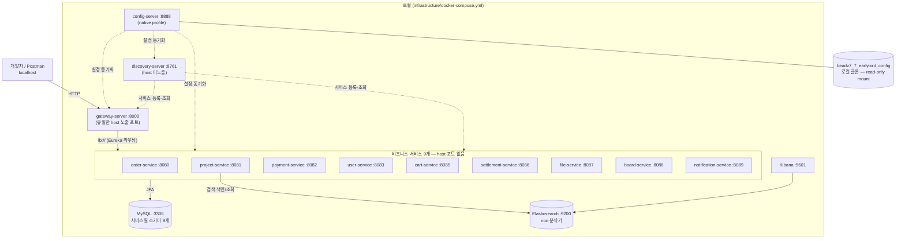
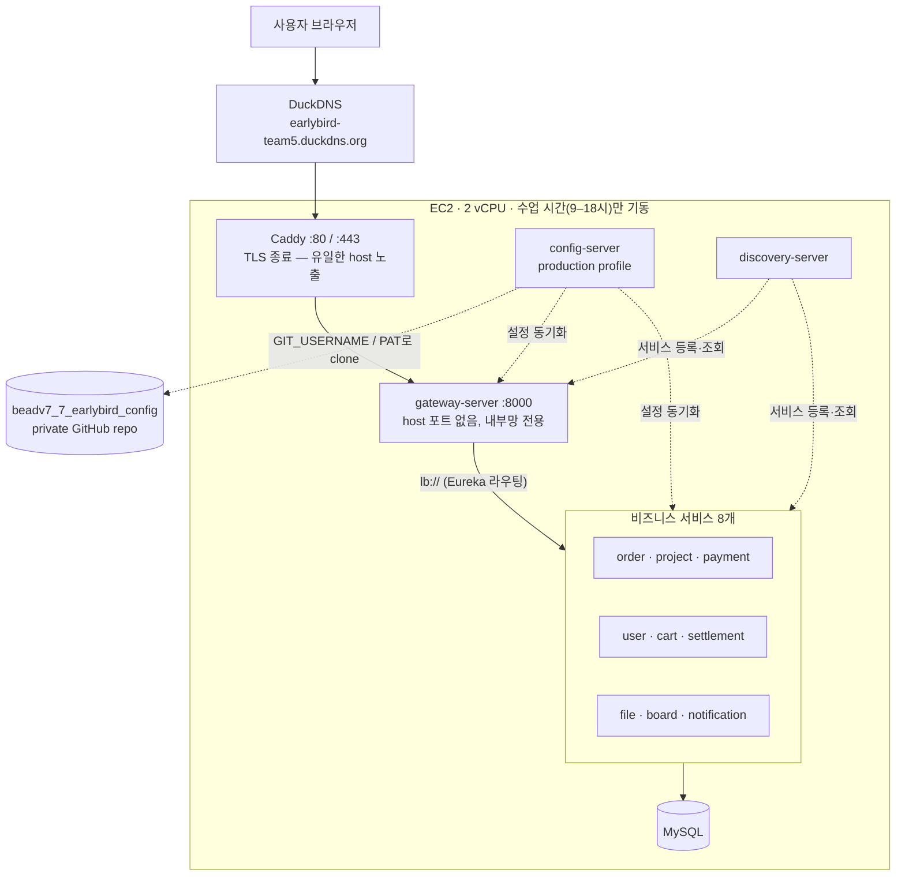
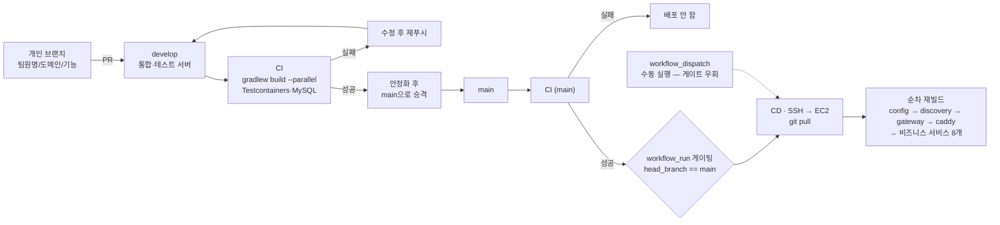

# 얼리버드 인프라 다이어그램

**담당**: 김하나한 — gateway-server · config-server · discovery-server · user-service · CI/CD
**레포**: beadv7_7_earlybird_BE (develop / main) · **갱신일**: 2026-07-29

---

## 01. 로컬 개발 — docker compose

gateway-server의 `:8000`만 호스트에 열려 있다. 나머지 서비스는 컴포즈 내부망 + Eureka로만 서로를 찾는다 — 게이트웨이를 거치지 않고는 `/internal/**`을 포함해 어떤 서비스도 직접 두드릴 수 없다.

*출처: `infrastructure/docker-compose.yml`*

---

## 02. 프로덕션 — EC2 배포 토폴로지

운영에서는 gateway-server도 host 포트를 닫는다. Caddy가 새 단일 진입점이 되어 TLS를 종료하고, 검증된 요청만 gateway-server로 넘긴다 — "게이트웨이만 문을 연다"는 원칙은 그대로, 문지기만 한 겹 늘었다.

*출처: `infrastructure/docker-compose.prod.yml`, `infrastructure/Caddyfile`*

---

## 03. CI/CD 파이프라인

CD는 push가 아니라 **CI 성공 이벤트**에 게이팅되어 있다 — 테스트가 깨진 커밋이 배포되던 사고(#111)를 겪은 뒤 고쳤다. EC2 배포는 11개 이미지를 한 번에 빌드하지 않고 서비스 하나씩 순차로 빌드한다.

*출처: `.github/workflows/ci.yml`, `.github/workflows/cd.yml`*

---

## 04. 설계 노트

**단일 진입점**
로컬은 gateway-server(`:8000`), 운영은 Caddy(`:80`/`:443`)만 host에 열려 있다. 다른 서비스가 실수로 포트를 열면 `/internal/**`처럼 외부에 드러나면 안 되는 엔드포인트가 게이트웨이를 우회해 노출된다.

**설정 단일 출처**
포트·DB URL·JWT 시크릿은 코드가 아니라 config-server가 private 레포에서 내려준다. 로컬은 `native` 프로파일(로컬 파일 마운트), 운영은 git 원격(PAT 인증) — 같은 코드, 다른 소스.

**서비스 탐색**
discovery-server(Eureka)가 이름 → 주소를 매핑한다. 서비스가 재시작해 포트가 바뀌어도 호출하는 쪽은 `lb://SERVICE-NAME`만 알면 된다.

**배포 게이팅**
CD는 push가 아니라 CI의 `workflow_run` 완료 이벤트를 구독하고, `head_branch == main && conclusion == success`일 때만 실행된다. 깨진 코드가 배포되던 실제 사고(#111) 이후의 수정.

**순차 재빌드**
2 vCPU EC2에서 11개 이미지를 동시 빌드하다 CPU가 감당하지 못해 sshd까지 응답 불가 상태가 된 실제 장애를 겪었다. 서비스 하나씩 순차로 빌드하도록 바꿔 전체 시간은 늘었지만 박스가 멈추지 않는다.

---

*얼리버드(Earlybird) — 백엔드 심화 데브코스 7기 Team 5*
