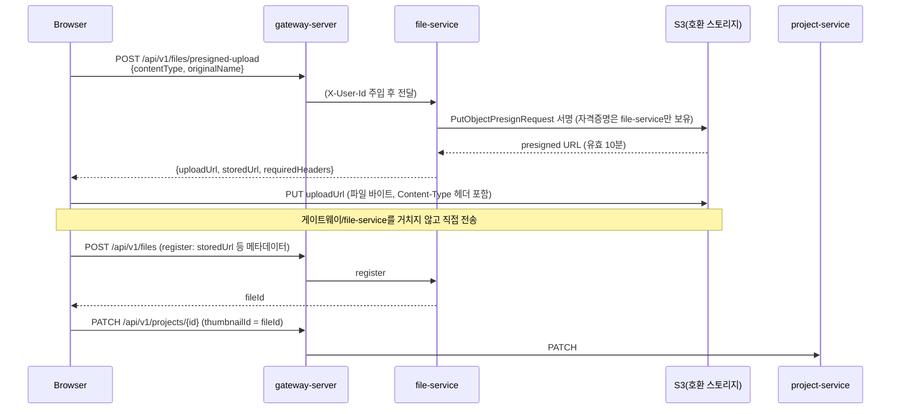

# File Service

파일(이미지 등) 메타데이터를 관리하는 서비스. 실제 바이너리는 이 서비스가 직접 받지 않고 S3(호환) 오브젝트 스토리지에 저장하며, file-service는 "누가 어떤 파일을 어디에(storedUrl) 올렸는지"에 대한 메타데이터 레코드만 갖는다.

담당 도메인은 `File` 하나뿐이다. 소유자는 `ownerType`(`PROJECT`: 프로젝트 썸네일, `REVIEW`: board-service 후기 사진) + `ownerId`(다른 서비스 DB의 논리적 FK, 예: `projectdb.projects.id`) 다형 참조로 표현한다 — 다른 용도로 더 확장해도 테이블 추가 없이 `FileOwnerType`에 값만 늘리면 된다. 이 레포의 다른 서비스와 동일하게 크로스 서비스 참조는 ID로만 하고 JPA 연관관계를 걸지 않는다.

## 왜 이 방식인가 — 업로드 방식 선택

file-service를 설계하며 붙어있던 실질적 질문은 "브라우저가 고른 이미지 파일 바이트를 서버까지 어떤 경로로 옮길 것인가"였다. 세 가지를 놓고 비교했다.

### 후보 1 — 백엔드 프록시 업로드 (Backend Proxy Upload)

브라우저가 `multipart/form-data`로 파일을 file-service에 직접 보내고, file-service가 그 바이트를 다시 S3로 전달(proxy)하는 방식. 흔히 "제일 단순해 보이는" 선택지다.

- **장점**: 클라이언트가 스토리지 자격증명/URL을 전혀 몰라도 됨. 서버가 모든 검증(용량, 바이러스 스캔 등)을 요청 시점에 동기로 강제할 수 있음.
- **단점**:
  - 파일 바이트가 브라우저 → 게이트웨이 → file-service → S3, 왕복 두 번을 탄다. 대용량 이미지 여러 장을 동시에 올리면 file-service 인스턴스의 CPU/메모리/네트워크 대역폭이 고스란히 소모된다 — 이 서비스는 메타데이터 CRUD 하나 처리하자고 파일 전송 대역폭까지 짊어지게 된다.
  - Spring MVC 서블릿 스레드가 업로드가 끝날 때까지 요청 하나를 물고 있어야 해서(스트리밍하지 않는 한) 동시 업로드가 늘수록 스레드풀이 먼저 고갈된다.
  - 게이트웨이의 요청 바디 크기 제한, 타임아웃 설정을 업로드 전용으로 다시 튜닝해야 하고, 그 설정이 다른 API 트래픽에도 영향을 준다.

### 후보 2 — Cloudinary류 unsigned upload

Cloudinary(혹은 유사 서비스)가 제공하는 "unsigned upload preset"에 브라우저가 **백엔드를 거치지 않고** 바로 업로드하는 방식. 프론트가 API 키/preset 이름만 들고 있으면 업로드가 끝난다.

- **장점**: 구현이 제일 짧다 — 백엔드에 엔드포인트를 하나도 안 만들어도 됨. 이미지 변환/CDN까지 딸려 온다.
- **단점**:
  - "unsigned"라는 이름 그대로, 업로드 요청 자체에 서버 측 인가가 끼어들 지점이 없다. 로그인 여부, 요청자 신원, 무슨 목적의 업로드인지를 우리 JWT 체계(`X-User-Id`/`X-User-Role`, 게이트웨이가 검증)로 전혀 통제할 수 없다 — preset을 아는 사람은 누구나(비로그인 포함) 업로드가 가능해진다.
  - 이 저장소는 이미 자체 S3 인프라를 전제로 설계돼 있고(다른 서비스들도 동일 클라우드 계정 하에 있음), 파일 저장만을 위해 서드파티 SaaS에 데이터와 트래픽을 맡기는 벤더 종속을 새로 들이는 셈이다. 정산/주문처럼 자체 인프라 안에서 감사(audit) 가능해야 하는 흐름과 저장 위치가 어긋난다.
  - 무료/저가 플랜의 트래픽·용량 상한, 가격 정책 변화가 곧바로 서비스 안정성 리스크가 된다.

### 후보 3 — Presigned Upload (채택)

file-service가 **자격증명 없이도 정해진 시간 동안 S3에 PUT 할 수 있는 서명된 URL**을 발급하고, 브라우저는 그 URL로 파일 바이트를 S3에 직접 PUT 한다. 파일 바이트는 file-service도, 게이트웨이도 거치지 않는다.



- **서버 부하**: 파일 바이트가 file-service를 지나가지 않으므로, 업로드 트래픽이 늘어도 file-service의 CPU/메모리/스레드는 영향받지 않는다. file-service가 실제로 하는 일은 "서명 계산" 하나뿐이고, 이건 로컬 SigV4 연산이라 네트워크 호출조차 없다(`S3PresignedUploadGeneratorTest`가 실제 자격증명 없이도 이 부분을 테스트할 수 있는 이유이기도 하다).
- **보안 통제**: URL 발급 자체가 우리 JWT 인증(`X-User-Id` 필수 헤더)을 통과해야만 나간다 — Cloudinary unsigned upload처럼 "preset만 알면 누구나"가 아니다. 발급된 URL은 정확히 하나의 `(bucket, key, contentType)` 조합에 대해서만, 정해진 시간(10분) 동안만 유효하다. 이 프로젝트에서는 여기에 더해 `contentType`을 이미지 MIME 허용 목록으로 제한하고(`PresignedUploadRequest`), 오브젝트 키에 들어가는 확장자를 영숫자로만 제한한다(`S3PresignedUploadGenerator`) — presign 자체는 안전해도 "무엇을 PUT 하게 허용할지"는 우리가 계속 통제해야 하는 지점이기 때문이다. 자세한 내용은 아래 [보안 고려사항](#보안-고려사항) 참고.
- **인프라 종속성**: 이미 이 조직이 쓰는 S3(호환) 스토리지를 그대로 쓴다 — 새 SaaS 벤더가 늘지 않는다.
- **트레이드오프로 받아들인 것**: presigned PUT은 S3 스펙상 "이 URL로는 최대 N바이트까지만 업로드 가능"이라는 제약을 걸 수 없다(이걸 걸려면 브라우저 form 기반의 presigned **POST** policy로 바꿔야 하는데, FE는 이미 "브라우저가 uploadUrl로 파일 바이트를 직접 PUT"하는 흐름으로 구현을 끝낸 상태라 계약을 바꾸면 양쪽 다시 작업이 필요하다). 지금은 인증된 사용자만 URL을 받을 수 있다는 점으로 위험을 낮추고, 실제 남용이 확인되면 버킷 lifecycle 정책이나 CDN(CloudFront 등) 단에서 크기 제한을 추가하는 쪽으로 남겨뒀다.

세 후보를 한 표로 정리하면:

| | 백엔드 프록시 업로드 | Cloudinary unsigned upload | Presigned Upload (채택) |
|---|---|---|---|
| 파일 바이트가 file-service를 통과하는가 | O (부하 직접 부담) | X | X |
| 우리 JWT로 업로드 자체를 인가할 수 있는가 | O | X (preset만 알면 누구나) | O |
| 새 서드파티 벤더 종속 | 없음 | 있음 (Cloudinary 등) | 없음 (기존 S3 그대로) |
| 업로드 용량 상한을 URL 자체에 걸 수 있는가 | O (서버가 직접 검증) | 서비스 정책에 따름 | X (presigned PUT의 한계, 알려진 트레이드오프) |
| 백엔드 구현 비용 | 중간 (스트리밍/검증 로직 필요) | 거의 없음 | 낮음 (서명 발급 엔드포인트 1개) |

## API

게이트웨이 라우트: `/api/v1/files/**` — StripPrefix 없이 경로 그대로 file-service에 전달되므로(다른 서비스들과 동일한 관례, `gateway-server.yml` 참고), 컨트롤러도 `@RequestMapping("/api/v1/files")`로 매핑돼 있다. 게이트웨이가 `/api/v1/files/**` 전체를 `authenticated()`로 막아둬서(별도 `permitAll` 없음) 네 엔드포인트 모두 `X-User-Id` 없이는 호출 자체가 안 된다. 그중 `register`/`delete`는 거기서 한 단계 더 나아가 애플리케이션 레벨 소유권 검증도 한다 — 아래 각 엔드포인트 설명과 [보안 고려사항](#보안-고려사항) 참고.

| Method | Path | 설명 |
|---|---|---|
| `POST` | `/api/v1/files/presigned-upload` | S3 presigned PUT URL 발급 |
| `POST` | `/api/v1/files` | 업로드 완료된 파일의 메타데이터 등록 (소유권 연결) |
| `GET` | `/api/v1/files?ownerType=&ownerId=` | 소유자 기준 파일 목록 조회 |
| `DELETE` | `/api/v1/files/{fileId}` | 파일 메타데이터 삭제 |

### `POST /api/v1/files/presigned-upload`

인증 필요 (`X-User-Id` 헤더, 게이트웨이가 JWT 검증 후 주입).

요청:
```json
{
  "contentType": "image/jpeg",
  "originalName": "thumb.jpg"
}
```
`contentType`은 `image/jpeg`, `image/png`, `image/webp`, `image/gif` 중 하나만 허용된다(Bean Validation `@Pattern`). 그 외 값은 400으로 거부된다.

응답:
```json
{
  "uploadUrl": "https://<bucket>.s3.<region>.amazonaws.com/files/42/2026/08/<uuid>.jpg?X-Amz-Signature=...",
  "storedUrl": "https://<cdn-base-url>/files/42/2026/08/<uuid>.jpg",
  "requiredHeaders": { "Content-Type": "image/jpeg" }
}
```
- 오브젝트 키 형식: `files/{requesterId}/{yyyy}/{MM}/{uuid}{확장자}`. `requesterId`를 포함시킨 이유는 나중에 "이 업로드를 누가 요청했는지"를 키만 보고 추적하거나(예: 정리 배치가 특정 유저의 orphan 오브젝트를 찾을 때), 프로젝트 연결 없이 버려진 업로드를 구분하기 위함이다.
- URL 유효시간: 10분 (`S3PresignedUploadGenerator.EXPIRATION`).
- 브라우저는 응답의 `uploadUrl`로 `requiredHeaders`를 그대로 실어 `PUT`(파일 바이트가 body)하면 된다. 이 요청은 file-service/게이트웨이를 거치지 않고 S3로 직접 간다.

### `POST /api/v1/files` (register)

인증 필요 (`X-User-Id` 헤더). presigned PUT이 끝난 뒤, 그 결과(`storedUrl`)를 실제 소유자(`ownerType`/`ownerId`)와 연결하는 단계. presign 단계는 아직 없는 리소스(예: 생성 전 프로젝트)에 대한 업로드도 허용해야 해서 소유권 연결을 이 단계로 분리했다 — presign 요청 시점엔 `ownerId`를 아예 받지 않는다.

요청:
```json
{
  "ownerType": "PROJECT",
  "ownerId": 10,
  "storedUrl": "https://<cdn-base-url>/files/42/2026/08/<uuid>.jpg",
  "originalName": "thumb.jpg",
  "contentType": "image/jpeg",
  "fileSize": 204800,
  "sortOrder": 0
}
```

`ownerType=PROJECT`면 요청자(`X-User-Id`)가 `ownerId` 프로젝트의 창작자인지 확인한 뒤 등록한다 — 아니면 403, project-service 확인 자체가 실패하면(타임아웃 등) 503. `ownerType=REVIEW`는 아직 이 확인을 하지 않는다(알려진 한계, [보안 고려사항](#보안-고려사항) 참고). `File`에는 요청자가 `uploaderId`로 함께 저장돼 `DELETE`의 본인 확인에 쓰인다.

응답 `FileResponse`는 `File` 엔티티 필드를 그대로 반영한다 (`id`, `ownerType`, `ownerId`, `storedUrl`, `originalName`, `contentType`, `fileSize`, `sortOrder`).

### `GET /api/v1/files?ownerType=PROJECT&ownerId=10`

해당 소유자의 파일 목록을 `FileResponse` 배열로 반환한다.

### `DELETE /api/v1/files/{fileId}`

인증 필요 (`X-User-Id` 헤더). 삭제 요청자가 그 파일을 등록한 `uploaderId`와 다르면 403. 메타데이터 레코드만 삭제한다 — **S3 오브젝트 자체는 지우지 않는다** (아래 [현재 구현 범위](#현재-구현-범위-및-미해결-과제) 참고).

## 도메인 모델

```
File
├─ id            (PK)
├─ ownerType     (FileOwnerType: PROJECT/REVIEW — 다형 참조용, 향후 USER_AVATAR 등 추가 가능)
├─ ownerId       (다른 서비스 DB의 논리적 FK, 예: projectdb.projects.id)
├─ storedUrl     (필수, CDN/스토리지 접근 URL)
├─ originalName
├─ contentType
├─ fileSize      (필수, 0보다 커야 함)
├─ sortOrder     (같은 owner 안에서 노출 순서, 예: 프로젝트 이미지 여러 장)
└─ BaseEntity    (created/updated 타임스탬프, JPA Auditing)
```

생성자(`File.register`)에서 `ownerId`/`storedUrl`/`fileSize`에 대한 최소 불변식만 검증한다(null/blank/음수 금지) — 나머지 검증(파일 형식, 크기 상한 등)은 presign 단계(Bean Validation)와 업로드 자체(스토리지 쪽 제약)에서 이미 걸러졌다고 보고 도메인에서는 반복하지 않는다.

레이어 구성은 이 저장소의 다른 서비스와 동일한 패턴이다: `presentation`(컨트롤러 + DTO) → `application`(서비스 + 커맨드/인포 DTO + `port`의 크로스 서비스 인터페이스) → `domain`(엔티티 + 리포지토리 인터페이스) → `infrastructure`(JPA 구현체, S3 presign 구현체, `client`의 project-service HTTP 어댑터).

프로젝트 소유권 확인은 `application/port/ProjectPort` 인터페이스로 추상화돼 있고, 실제 구현(`infrastructure/client/ProjectHttpClient`)은 `RestClient` + `CircuitBreakerFactory`로 project-service를 호출한다 — cart-service가 project-service를 호출하는 것과 같은 패턴(`RewardHttpClient`).

## 설정

`aws.s3.*`는 config-server의 `file-service.yml`에 정의돼 있고, 값은 전부 환경변수 기반이다:

```yaml
aws:
  s3:
    bucket: ${AWS_S3_BUCKET:earlybird-files}
    region: ${AWS_REGION:ap-northeast-2}
    cdn-base-url: ${AWS_S3_CDN_BASE_URL:https://${aws.s3.bucket}.s3.${aws.s3.region}.amazonaws.com}
```

AWS 자격증명은 애플리케이션 설정이 아니라 **AWS SDK 기본 자격증명 체인**(`AWS_ACCESS_KEY_ID`/`AWS_SECRET_ACCESS_KEY` 환경변수, 인스턴스 프로필 등)을 그대로 쓴다(`S3Config`) — 커스텀 자격증명 처리 코드를 만들지 않았다.

## 보안 고려사항

- **`contentType` 허용 목록**: presign 시 임의 MIME 타입(예: `text/html`)을 허용하면, 공격자가 그 타입으로 PUT한 오브젝트가 CDN에서 그대로 그 MIME으로 서빙되어 저장형 XSS로 이어질 수 있다. 이미지 업로드 용도이므로 `image/jpeg|png|webp|gif`로 제한했다.
- **오브젝트 키 경로 조작 방지**: `originalName`에서 뽑은 확장자를 검증 없이 키에 이어붙이면 `a.jpg/../../secret` 같은 입력으로 키에 `/`나 `..`가 섞여 들어갈 수 있다. 확장자는 `^\.[a-zA-Z0-9]{1,10}$` 패턴에 맞을 때만 반영하고, 아니면 통째로 버린다.
- **업로드 용량 상한 없음 (알려진 한계)**: presigned PUT 방식은 S3 스펙상 URL 자체에 최대 업로드 크기를 강제할 방법이 없다(그러려면 presigned POST policy로 바꿔야 함). 지금은 URL 발급 자체가 인증된 사용자에게만 나간다는 점으로 위험을 낮췄고, 실제 남용이 관측되면 버킷 lifecycle 정책이나 CDN 단에서 별도로 제한을 추가해야 한다.
- **presigned URL 유효시간**: 10분으로 제한해 탈취/재사용 가능 시간을 최소화한다.
- **`register`/`delete`는 인증된 사용자만 호출 가능**: 게이트웨이가 `/api/v1/files/**` 전체를 `authenticated()`로 막아둬서(별도 permitAll 없음) `X-User-Id` 없는 호출 자체가 불가능하다.
- **`DELETE`는 업로더 본인만 가능**: `File`에 `uploaderId`(register 시 JWT `X-User-Id`)를 저장해두고, 삭제 요청자가 그 값과 다르면 403(`BusinessException`)으로 거부한다 — 그 전에는 로그인만 하면 다른 사람이 올린 파일도 지울 수 있는 IDOR였다.
- **`register`의 `ownerId` 소유권 검증은 `PROJECT`만 된다.** `ownerType=PROJECT`면 project-service가 board-service용으로 이미 노출해 둔 `GET /internal/v1/projects/{projectId}/creator`를 file-service가 호출해(`ProjectPort`/`ProjectHttpClient`, Eureka-to-Eureka 직접 호출, project-service 코드 변경 없음) `requesterId == creatorId`가 아니면 403으로 거부한다. 이 확인 호출 자체가 실패하면(서킷 OPEN, 타임아웃 등) **낙관적으로 통과시키지 않고 503으로 거부한다(fail-closed)** — 소유권 검증은 보안 경계라 project-service 장애를 우회 수단으로 쓸 수 있으면 안 되기 때문이다(cart의 리워드 조회처럼 장애 시 낙관적으로 통과시키는 것과는 반대 방향 선택). `ownerType=REVIEW`는 board-service에 동등한 내부 API가 아직 없어 이번 범위(file-service/project-service)에서는 검증할 수 없다 — board-service 쪽에 후속 이슈가 필요하다.

## 현재 구현 범위 및 미해결 과제

- **실제 S3 버킷/자격증명이 아직 없다.** 운영이 k8s 기반이라 `.env` 개념이 없고 GitHub Secrets → `cd.yml`(`kubectl create secret`) → Deployment `secretKeyRef` 흐름을 쓴다(`payment-secrets` 등과 동일 패턴) — 이 흐름으로 `AWS_ACCESS_KEY_ID`/`AWS_SECRET_ACCESS_KEY`/`AWS_S3_BUCKET`/`AWS_S3_CDN_BASE_URL`을 연결해야 실제로 동작한다. 요청 이슈: #354.
- **`register`의 `ownerId` 소유권 검증이 `REVIEW` 타입은 아직 안 된다.** 위 보안 고려사항 참고 — board-service 쪽 내부 API 작업이 필요하다.
- **`DELETE /api/v1/files/{fileId}`가 S3 오브젝트를 지우지 않는다.** 메타데이터만 삭제되고 실제 스토리지 오브젝트는 고아로 남는다 — 스토리지 정리는 별도 배치나 버킷 lifecycle 정책으로 처리해야 한다.
- **presign만 하고 실제로 `register`가 호출되지 않은 업로드(고아 오브젝트)를 정리하는 배치가 없다.** 오브젝트 키에 `requesterId`가 들어가 있어 추적 자체는 가능하지만, 자동 정리는 아직 구현돼 있지 않다.
- **presigned PUT의 업로드 용량 상한을 걸 수 없다** — 위 보안 고려사항 참고.
