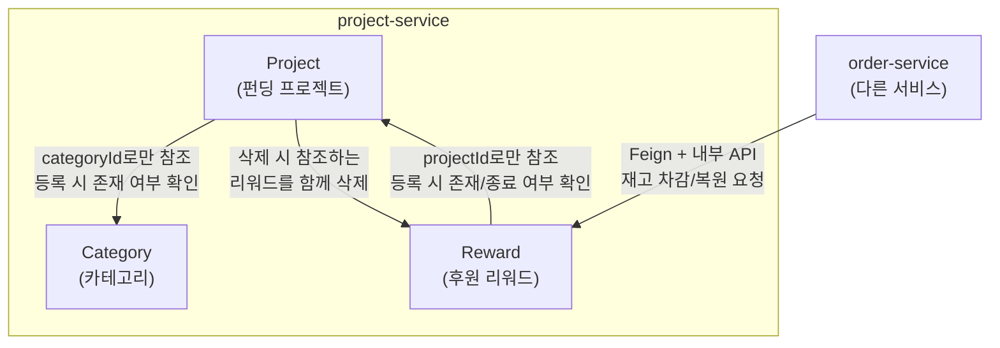

# project-service 도메인 가이드 — Category / Project / Reward

담당: 강대혁

이 문서는 "브랜치가 왜 이렇게 나뉘어 있는지", "각 도메인이 무슨 기술로 어떻게 동작하는지", "도메인끼리 서로 어떻게 연결되는지"를 최대한 쉽게 풀어서 설명합니다. 코드를 처음 보는 사람도 이 문서만 읽으면 전체 그림이 잡히는 걸 목표로 합니다.

---

## 1. 브랜치가 왜 3개로 나뉘어 있는가

`project-service` 안에는 도메인이 3개 있습니다 — **Category(카테고리)**, **Project(프로젝트)**, **Reward(리워드)**. 이 셋은 서로 다른 브랜치, 다른 PR로 develop에 합쳐졌습니다.

```
강대혁/category  →  PR  →  develop   (가장 먼저)
강대혁/project   →  PR  →  develop   (그 다음)
강대혁/reward    →  PR  →  develop   (마지막)
```

**왜 순서가 중요한가?** Project 도메인의 코드(`ProjectServiceImpl`)가 프로젝트를 등록할 때 "이 categoryId가 실제로 존재하는 카테고리인가?"를 Category 도메인의 코드(`ProjectCategoryRepository`)를 직접 호출해서 확인합니다. 즉 **Project는 Category가 이미 있어야 컴파일도 되고 동작도 합니다.** 그래서 Category를 먼저 develop에 합치고, 그 위에 Project를 얹고, 마지막에 Reward를 얹는 순서로 진행했습니다.

반대로 Reward는 Project를 "숫자 하나(`projectId`)"로만 참조하기 때문에 굳이 Project 코드를 가져다 쓰지 않습니다. 그래서 순서가 조금 유연했지만, 팀 컨벤션(도메인 하나 = 브랜치 하나 = PR 하나)을 지키기 위해 똑같이 별도 브랜치로 분리했습니다.

**왜 도메인마다 브랜치/PR을 쪼개는가?** 세 도메인을 한 PR에 몰아넣으면 리뷰어가 한 번에 봐야 할 코드량이 너무 많아지고, 하나의 도메인에서 문제가 생겨도 전체 PR이 막힙니다. 도메인 단위로 쪼개면 리뷰가 가볍고, 문제가 생겨도 그 도메인만 다시 작업하면 됩니다. (실제로 이 프로젝트 초반에 세 도메인을 한 브랜치/PR로 묶어서 올렸다가, 나중에 이 컨벤션이 확정되면서 그 merge를 되돌리고(revert) 다시 도메인별로 쪼갠 이력이 git log에 남아 있습니다.)

---

## 2. 공통 아키텍처: 계층형 구조 + 도메인별 패키지

세 도메인 모두 **같은 방식으로 코드를 정리**합니다. 폴더(패키지)를 아래 4개로 나눕니다.

```
category/  (또는 project/, reward/)
├── presentation/    ← 외부와 만나는 곳 (HTTP 요청/응답)
├── application/     ← 업무 흐름을 조율하는 곳 (트랜잭션, 순서 제어)
├── domain/          ← 진짜 규칙이 있는 곳 (엔티티, 검증 로직)
└── infrastructure/  ← DB 등 외부 기술과 실제로 연결하는 곳
```

**비유로 설명하면 레스토랑과 같습니다:**
- `presentation` = **손님을 응대하는 웨이터**. 주문(HTTP 요청)을 받아서 주방에 전달하고, 완성된 요리(응답)를 손님에게 가져다줍니다. 요리를 직접 만들지 않습니다.
- `application` = **주방장**. "이 주문을 어떤 순서로 처리할지" 조율합니다 (예: 재료가 있는지 먼저 확인하고 → 조리하고 → 접시에 담는다). 트랜잭션(`@Transactional`)의 시작과 끝도 여기서 관리합니다.
- `domain` = **레시피 그 자체**. "이 요리는 이 재료가 없으면 못 만든다" 같은 진짜 규칙이 여기 있습니다 (예: `Project.approve()`는 `PENDING_REVIEW` 상태가 아니면 예외를 던짐). 이 계층은 DB가 뭔지, HTTP가 뭔지 전혀 모릅니다 — 순수하게 업무 규칙만 압니다.
- `infrastructure` = **냉장고/창고**. 실제로 DB에 저장하고 꺼내오는 코드(`JpaRepository`)가 여기 있습니다.

이렇게 나누는 이유는, **"업무 규칙"(domain)과 "저장 방식"(infrastructure)을 분리**해두면 나중에 DB를 MySQL에서 다른 걸로 바꾸거나, HTTP 대신 다른 방식으로 요청을 받아도 `domain` 코드는 안 건드려도 되기 때문입니다. (이 방식을 흔히 "헥사고날 아키텍처" 또는 "포트&어댑터 패턴"이라고 부릅니다.)

패키지 이름 앞에 도메인 이름이 붙는 이유(`ProjectCategory`, 클래스 위치가 `project.category.*`)는, 이 프로젝트가 "도메인별로 패키지를 나누는" 방식(package-by-feature)을 쓰기 때문입니다. 계층(`controller`, `service`처럼)으로만 나누면 도메인이 늘어날수록 어떤 파일이 어떤 기능 소속인지 찾기 어려워지는데, 도메인별로 먼저 나누고 그 안에서 계층을 나누면 "Category 관련 코드는 다 `category/` 폴더 안에 있다"는 게 명확해집니다.

---

## 3. 도메인별 상세 설명

### 3.1 Category — 계층형 카테고리

**하는 일**: "패션 > 의류 > 상의"처럼 카테고리를 몇 단계든 자유롭게 쌓을 수 있는 트리 구조를 관리합니다.

**어떻게 구현했나 — 셀프 참조(Self-Reference)**

카테고리 하나(`ProjectCategory`)는 자기 부모 카테고리의 ID(`parentCategoryId`)만 숫자로 갖고 있습니다.

```java
class ProjectCategory {
    Long id;
    Long parentCategoryId;  // 부모의 id. 최상위 카테고리면 null
    String name;
}
```

**왜 JPA의 `@ManyToOne` 연관관계로 안 만들었나?** JPA 연관관계로 만들면 편리해 보이지만, "순환 참조가 생기지 않는지" 검증하는 로직을 짤 때 오히려 더 복잡해집니다. 그냥 숫자(id)로만 참조하면 "이 id가 실제 존재하는가"만 확인하면 되고, 부모를 계속 따라 올라가는 로직도 단순한 반복문으로 짤 수 있습니다.

**순환 참조는 왜 막아야 하나?** 만약 "의류"의 부모를 "상의"로 설정해버리면 — "의류 → 상의 → 의류 → 상의 → ..." 처럼 끝없이 돌게 됩니다. 트리를 그리려고 하면 무한 루프에 빠집니다. 그래서 부모를 바꿀 때마다 아래 로직으로 미리 막습니다:

```
새 부모 후보(newParentId)에서 시작해서, "그 부모의 부모"를 계속 타고 올라간다.
올라가는 도중에 "지금 수정하려는 카테고리 자기 자신"을 만나면
  → 그 새 부모는 사실 내 자손이었다는 뜻 → 순환이 생기니까 거부한다.
만약 새 부모가 자기 자신이면 → 당연히 거부한다.
```

예를 들어 "의류(1) → 상의(2) → 반팔(3)"이 있는 트리에서, "의류(1)의 부모를 반팔(3)로 바꾸겠다"는 요청이 오면: 3부터 시작해서 부모를 타고 올라가면 3→2→1이 되는데, 이 도중에 "1"(수정 대상 자기 자신)을 만나므로 거부됩니다.

**트리 조회는 어떻게?** DB에서는 그냥 "부모 id 컬럼이 있는 flat한 목록"으로 저장되어 있습니다. 화면에 보여줄 트리 모양으로 조립하는 건 서비스 코드에서 합니다 — 전체 목록을 한 번에 가져온 다음, `parentCategoryId` 기준으로 그룹핑하고, 부모가 없는(`null`) 것부터 시작해서 재귀적으로 자식을 채워 넣습니다.

**사용 기술**: Spring Data JPA(`JpaRepository`), Bean Validation(`@NotBlank`)

---

### 3.2 Project — 펀딩 프로젝트 (All-or-Nothing)

**하는 일**: 크라우드펀딩의 "캠페인" 그 자체입니다. 목표 금액, 펀딩 기간, 상태(심사중/진행중/성공/실패 등)를 관리합니다.

**상태 전이 (Project의 심장)**

```
   등록                승인               (마감 후 판정 — 아직 미구현)
PENDING_REVIEW ──────→ IN_PROGRESS ──────→ SUCCEEDED / FAILED / CANCELLED
      │
      └──(반려)──→ REJECTED
```

- 프로젝트를 등록하면 무조건 `PENDING_REVIEW`(심사 대기)로 시작합니다.
- 관리자가 `approve()`를 부르면 `IN_PROGRESS`(진행중)로 바뀝니다. `reject(사유)`를 부르면 `REJECTED`(반려)로 바뀝니다.
- 상태를 코드로 직접 바꾸지 못하게, `Project` 엔티티 안에 `approve()`, `reject()` 같은 **메서드로만** 상태를 바꿀 수 있게 막아뒀습니다. 그리고 그 메서드 안에서 "지금 상태가 PENDING_REVIEW가 아니면 예외를 던진다"처럼 **엉뚱한 순서로 상태가 바뀌는 걸 원천 차단**합니다.

```java
public void approve() {
    requireStatus(PENDING_REVIEW, "승인은 심사 대기 상태에서만 가능합니다.");
    this.status = IN_PROGRESS;
}
```

**공개 전 / 공개 후로 수정 가능한 필드가 다른 이유**

프로젝트가 아직 심사 중이거나 반려된 상태(`isPublished() == false`)일 때는 창작자가 제목, 목표금액, 기간 등 전부 자유롭게 고칠 수 있습니다. 하지만 한 번이라도 승인돼서 공개된 적이 있으면(`isPublished() == true`), 후원자들이 이미 그 정보를 보고 후원을 결정했을 수 있기 때문에 목표금액이나 기간 같은 핵심 정보는 못 바꾸게 막고 `summary`/`description`/`thumbnailId`만 고칠 수 있게 했습니다. (마감일 연장은 창작자가 아예 못 하고, 관리자 전용 API로만 가능하도록 별도 분리했습니다 — 팀에서 논의 후 확정한 정책입니다.)

**목록 조회에서 쓰는 동적 검색 — JPA Specification**

"키워드로 검색하거나 안 하거나, 카테고리로 거르거나 안 거르거나, 상태로 거르거나 안 거르거나"처럼 **조건이 있을 수도 없을 수도 있는 검색**을 짤 때, 조건 개수만큼 SQL을 따로 짜면 경우의 수가 너무 많아집니다. 그래서 Spring Data JPA의 `Specification`을 씁니다 — "조건이 있으면 그 조건을 SQL의 WHERE 절에 추가하고, 없으면 그냥 건너뛴다"는 방식으로 조건을 하나씩 쌓아서 마지막에 합칩니다.

```java
if (keyword != null) predicates.add(제목이나_요약에_keyword_포함);
if (categoryId != null) predicates.add(categoryId_일치);
if (status != null) predicates.add(status_일치);
// 이걸 AND로 전부 묶어서 최종 쿼리를 만든다
```

**자동으로 채워지는 시간 필드 — JPA Auditing**

`createdAt`(생성일시), `updatedAt`(수정일시)은 코드에서 직접 안 넣어도 Spring이 저장/수정 시점에 자동으로 채워줍니다 (`@CreatedDate`, `@LastModifiedDate`). 이 기능을 켜려면 애플리케이션 시작 클래스에 `@EnableJpaAuditing`을 붙여야 하는데, 이 프로젝트에서 이 기능을 쓰는 게 Project가 처음이라 이번에 새로 켰습니다.

**사용 기술**: Spring Data JPA, `JpaSpecificationExecutor`(동적 쿼리), Spring Data JPA Auditing

---

### 3.3 Reward — 후원 리워드 (동시성 제어가 핵심)

**하는 일**: 프로젝트 하나에 여러 개 달리는 "후원 옵션"입니다 (예: "3만원 후원 시 노트커버 1개"). 수량이 한정된 리워드(흔히 "얼리버드"라고 부르는 것)는 여러 사람이 동시에 주문할 때 **재고보다 더 많이 팔리지 않게** 막는 게 핵심 과제입니다.

**왜 동시성 문제가 생기나? (쉬운 설명)**

리워드 재고가 1개 남았다고 해봅시다. 사용자 A와 B가 정확히 같은 순간에 "이거 주문할게요" 요청을 보냅니다.

```
A: 재고 확인 → 1개 남음 → OK, 주문 진행
B: 재고 확인 → 1개 남음 → OK, 주문 진행   (A가 아직 차감을 안 끝낸 사이에!)
A: 재고 1 → 0으로 차감
B: 재고 1 → 0으로 차감   (사실 이미 0인데 또 차감!)
```

이렇게 "확인"과 "차감" 사이에 다른 요청이 끼어들면, 재고가 마이너스가 되거나 실제 재고보다 더 많이 팔리는 **오버셀링**이 일어납니다.

**어떻게 막았나 — 낙관적 락(Optimistic Lock) + 재시도**

`Reward` 엔티티에 `@Version` 필드를 하나 추가합니다. 이 필드는 이 행(row)이 몇 번 수정됐는지 세는 숫자입니다.

```java
@Version
private Long version;
```

동작 원리:
1. A가 리워드를 읽어옵니다 (이때 `version = 5`였다고 합시다).
2. A가 재고를 차감해서 저장하려고 하면, DB에 "지금 저장하려는 이 행의 version이 아직도 5인가?"를 같이 물어봅니다.
3. 그 사이에 B가 먼저 차감해서 저장에 성공했다면, DB의 실제 version은 이미 6으로 바뀌어 있습니다.
4. A가 "5인 채로 저장해줘"라고 요청했는데 DB는 이미 6이니까, **A의 저장은 실패**합니다 (`ObjectOptimisticLockingFailureException`).

즉 "일단 먼저 손대는 놈이 이기고, 뒤늦게 온 놈은 자동으로 튕겨나가는" 방식입니다. (이걸 "비관적 락"과 비교하면 이해가 쉬운데, 비관적 락은 "내가 다 쓸 때까지 아무도 못 건드리게 미리 잠그는" 방식이고, 낙관적 락은 "일단 다 같이 시도해보고, 충돌나면 그때 걸러내는" 방식입니다. 얼리버드 재고처럼 순간적으로 요청이 몰리는 상황엔 미리 잠그는 것보다 이 방식이 낫습니다.)

그런데 4번처럼 튕겨난 A 입장에서는 "그냥 실패"로 끝나면 안 되고, "다시 최신 재고를 읽어서 한 번 더 시도"해봐야 합니다. 이걸 자동으로 해주는 게 `@Retryable`입니다.

```java
@Retryable(retryFor = ObjectOptimisticLockingFailureException.class, maxAttempts = 3, backoff = @Backoff(delay = 50))
@Transactional
public void decreaseStock(...) { ... }
```

"버전 충돌 예외가 나면 최대 3번까지, 50ms씩 간격을 두고 다시 시도해라"는 뜻입니다. 재시도할 때마다 새 트랜잭션에서 최신 버전을 다시 읽기 때문에, 재시도가 트랜잭션을 감싸는 순서가 중요합니다 (`@EnableRetry(order = LOWEST_PRECEDENCE - 1)`로 순서를 명시적으로 맞춰놨습니다 — 안 그러면 재시도했는데도 계속 낡은 데이터를 보는 문제가 생길 수 있습니다).

3번 다 실패하면(`@Recover`) 그냥 500 에러를 던지는 대신, "지금 너무 몰려서 처리 못 했어요, 다시 시도해주세요"라는 뜻의 명확한 에러(`ConcurrentUpdateFailedException`, HTTP 409)로 바꿔서 응답합니다.

**개발 중 실제로 발견한 버그**: `@Recover`를 `@Retryable`이랑 같이 쓰면, Spring Retry가 "버전 충돌"이 아닌 다른 예외(예: "재고가 원래 부족함")까지도 전부 `@Recover`로 보내버리는 함정이 있었습니다. 그러다 보니 "재고 부족"이라는 지극히 정상적인 비즈니스 예외가 엉뚱하게 500 에러로 나가는 버그가 실제로 있었고, `@Recover(RuntimeException e) { throw e; }`처럼 "일단 다 받아서 원래 예외 그대로 다시 던지는" catch-all을 하나 더 만들어서 해결했습니다.

**무제한 리워드는 어떻게 처리하나?**

`totalQuantity`가 `null`이면 "무제한"으로 취급합니다. `decreaseStock`은 맨 앞에서 `active`(아래 참고)부터 확인하고, 그다음 "총 수량이 null이면 그냥 아무것도 안 하고 리턴"하도록 만들어서, 무제한 리워드는 재고 검증/락 경쟁 자체를 겪지 않습니다.

**비활성화(`active`)와 하드 삭제를 구분한 이유**

리워드가 한 번이라도 공개(프로젝트 승인)된 적이 있으면, 이미 후원자의 주문 데이터가 그 리워드를 참조하고 있을 수 있습니다. 이 상태에서 DB에서 진짜로 지워버리면(하드 삭제), 주문 데이터가 "존재하지 않는 리워드"를 가리키게 되는 문제가 생깁니다. 그래서 `Reward`에 `active`라는 boolean 필드를 두고:

- **공개 전** 리워드를 지우면 → 하드 삭제 (아직 아무도 주문 안 했을 테니 안전)
- **공개 후** 리워드를 "지워달라"고 하면 → 실제로는 지우지 않고 `active = false`로만 바꿉니다(소프트 삭제/"판매 종료" 처리)

중요한 건, 이 `active` 플래그가 **응답에 표시만 되는 게 아니라 실제 재고 차감 로직에서도 강제된다는 점**입니다 — `decreaseStock()`이 `active`가 `false`면 주문 자체를 막습니다. 그래야 "판매 종료" 처리한 리워드를 order-service가 뒤늦게 주문 성사시켜버리는 걸 막을 수 있습니다.

**공개 후엔 "누가" 뭘 할 수 있는지가 갈립니다**

프로젝트가 공개(`IN_PROGRESS`)된 이후에는 크리에이터와 관리자가 할 수 있는 일이 다릅니다 — 이미 후원자들이 리워드 정보를 보고 후원을 결정했을 수 있어서, "수량을 줄이거나 아예 없애는" 것처럼 후원자에게 불리하게 작용할 수 있는 조작은 크리에이터 권한 밖으로 뺐습니다.

| 동작 | 크리에이터 | 관리자 |
|---|---|---|
| 새 리워드 등록 | 가능 | - |
| 수량 **늘리기** | 가능 | - |
| 수량 **줄이기** | 불가 | 가능 (부득이한 경우만, 이미 판매된 수량 밑으로는 불가) |
| 비활성화("삭제") | 불가 | 가능 |

이건 `ProjectAdminController`가 이미 쓰고 있는 것과 같은 방식으로 구현했습니다 — 아직 인증 시스템이 없어서 "진짜 관리자인지" 검증은 못 하고, 지금은 **엔드포인트를 `/admin/...` 경로로 분리해서 의도만 명확히 해둔** 상태입니다. 나중에 인증이 들어오면 그 경로에 실제 role 체크를 추가하는 식으로 완성됩니다. 종료된(`SUCCEEDED`/`FAILED`/`CANCELLED`) 프로젝트의 리워드는 크리에이터·관리자 둘 다 아무것도 못 건드립니다 — 더 이상 주문이 안 들어오는 캠페인을 계속 손볼 이유가 없기 때문입니다.

**공개 API 목록**

```
크리에이터용 (RewardController, /api/v1/rewards)
  POST   /api/v1/projects/{projectId}/rewards   ← 리워드 등록
  GET    /api/v1/projects/{projectId}/rewards   ← 목록
  GET    /api/v1/rewards/{rewardId}             ← 상세
  PATCH  /api/v1/rewards/{rewardId}             ← 공개 전: 자유 수정 / 공개 후: 수량 추가만
  DELETE /api/v1/rewards/{rewardId}             ← 공개 전: 하드 삭제 / 공개 후: 거부(관리자 전용 API 이용 안내)

관리자용 (RewardAdminController, /api/v1/admin/rewards)
  PATCH  /api/v1/admin/rewards/{rewardId}/quantity   ← 공개 중 리워드 수량 축소
  DELETE /api/v1/admin/rewards/{rewardId}             ← 공개 중 리워드 비활성화

내부 API   (서비스끼리만 호출, 게이트웨이 라우팅 자체가 없음)
  POST /internal/rewards/{rewardId}/decrease-stock   ← order-service가 호출
  POST /internal/rewards/{rewardId}/restore-stock    ← order-service/settlement-service가 호출
```

재고 차감/복원은 "사용자가 직접 누르는 버튼"이 아니라 **주문이 실제로 성사될 때 order-service가 대신 요청해주는 것**이라서 공개 API로 열어둘 이유가 없습니다. 그래서 `/internal/...` 경로로 따로 빼놨고, 이 경로는 게이트웨이에 라우팅 규칙 자체를 안 만들어서 외부에서는 아예 호출할 방법이 없고, 서비스끼리 직접(Eureka로 서로의 위치를 찾아서) 통신할 때만 열립니다.

**사용 기술**: JPA `@Version`(낙관적 락), Spring Retry(`@Retryable`/`@Recover`), Spring AOP(재시도가 내부적으로 AOP 프록시로 동작)

---

## 4. 도메인 간 관계



**Project → Category**: `Project`는 `categoryId`라는 숫자만 갖고 있습니다. 프로젝트를 등록할 때 `ProjectServiceImpl`이 `ProjectCategoryRepository.existsById(categoryId)`를 직접 호출해서 "이 카테고리가 진짜 있는지"만 확인하고, 그 외에는 서로 관계없는 별도 테이블입니다. (JPA 연관관계를 안 걸어놓은 건 Category 내부와 같은 이유 — 결합을 느슨하게 유지하기 위해서입니다.)

**Reward → Project**: `Reward`는 `projectId`라는 숫자만 갖고 있습니다. 리워드를 등록할 때 `RewardServiceImpl`이 `ProjectRepository`를 직접 호출해서 "이 프로젝트가 실제 존재하는지"와 "이미 종료된 프로젝트는 아닌지"를 확인합니다. 리워드 수정/삭제(`update()`/`delete()`)도 마찬가지로 이 프로젝트가 지금 공개된 상태인지 확인해서 허용 범위를 정합니다 — 이때 일반 조회 대신 **공유 락(`LOCK IN SHARE MODE`)** 이 걸린 조회를 씁니다. 이유는: MySQL의 기본 격리수준(REPEATABLE READ)에서는 한 트랜잭션이 처음 조회한 시점의 DB 상태가 그 트랜잭션이 끝날 때까지 고정되는데, 관리자가 그 사이 프로젝트를 승인(commit)해도 이 스냅샷 때문에 옛날 상태(승인 전)로 착각할 수 있기 때문입니다. 공유 락 조회는 이 스냅샷을 우회해서 항상 최신 커밋 상태를 읽고, 만약 지금 딱 그 순간 다른 트랜잭션이 이 프로젝트 행을 수정 중이면 그 트랜잭션이 끝날 때까지 기다렸다가 읽습니다.

**Project → Reward (역방향)**: 프로젝트를 삭제할 때, 그 프로젝트를 참조하는 리워드가 남아있으면 부모를 잃은 "고아" 리워드가 됩니다. 이를 막기 위해 `ProjectServiceImpl.delete()`가 프로젝트를 지우기 전에 `RewardRepository.deleteByProjectId()`로 참조하는 리워드를 먼저 전부 삭제합니다. 즉 Reward와 Project는 서로의 리포지토리를 양방향으로 참조합니다 — 같은 서비스(같은 JVM, 같은 DB 커넥션) 안이라 이 정도 직접 참조는 허용되고, "숫자 ID로만 느슨하게 연결한다"는 원칙(엔티티/JPA 연관관계를 걸지 않는다는 원칙)만 지키면 됩니다.

**Reward ↔ order-service (다른 서비스, MSA 경계를 넘는 관계)**: 여기서부터는 프로세스 자체가 다른 서비스입니다. `project-service`와 `order-service`는 같은 DB도 안 쓰고 같은 JVM도 아닙니다. 그래서 "숫자 ID 참조"조차 안 되고, **HTTP로 직접 요청을 보내야** 합니다. order-service는 `RewardFeignClient`라는 인터페이스로 이 HTTP 호출을 선언하고, 실제 호출은 서킷 브레이커(Resilience4j)로 감싸서, project-service가 응답을 안 하면 정해진 대체 동작(fallback)으로 넘어가게 만들어져 있습니다. 이렇게 **다른 서비스와의 통신은 반드시 네트워크(HTTP)를 거치게 강제**하는 게 이 프로젝트 전체(project-service뿐 아니라 order-service, payment-service 등 모든 서비스)의 핵심 설계 원칙입니다 — 그래야 나중에 project-service를 통째로 다시 만들어도 order-service는 API 계약만 안 바뀌면 전혀 영향을 안 받습니다.

---

## 5. 기술 스택 한눈에 보기

| 기술 | 어디서 쓰나 | 왜 쓰나 |
|---|---|---|
| Spring Boot 4.1 / Java 21 | 전체 | 기본 프레임워크 |
| Spring Data JPA | 세 도메인 전부 | DB 접근(엔티티 ↔ 테이블 매핑) |
| `JpaSpecificationExecutor` | Project | 조건이 있을 수도 없을 수도 있는 동적 검색 |
| Spring Data JPA Auditing | Project | `createdAt`/`updatedAt` 자동 채움 |
| JPA `@Version` (낙관적 락) | Reward | 동시 재고 차감 시 충돌 감지 |
| Spring Retry (`@Retryable`/`@Recover`) | Reward | 낙관적 락 충돌 시 자동 재시도, 소진 시 명확한 에러로 변환 |
| Spring Validation (`@NotBlank` 등) | 세 도메인 전부 | 요청 DTO 값 검증 |
| MySQL (로컬 Docker) | 세 도메인 전부 | 실제 데이터 저장소 |
| Gradle 멀티모듈 | project-service 전체 | 다른 서비스와 독립적으로 빌드/배포 |

---

## 6. 지금 시점에서 알려진 한계

이 문서는 "어떻게 만들었는지" 설명이 목적이라 자세한 목록은 생략하지만, 요약하면:
- **인증(로그인) 시스템 자체가 아직 없어서**, "이게 진짜 그 프로젝트의 창작자가 요청한 게 맞는지" 같은 소유권 검증이 곳곳에 빠져 있습니다. 관리자 전용 API(`ProjectAdminController`, `RewardAdminController`)도 지금은 URL만 분리해뒀을 뿐, 실제로 "이 사람이 관리자인가"를 검증하지는 않습니다.
- Project의 **삭제 시 후원(주문) 여부 검증**(주문이 있으면 삭제 불가)은 아직 없습니다 — order-service 쪽에 "이 프로젝트에 주문이 있는지" 확인하는 API가 필요해서 별도 조율 중입니다. (참조하는 **리워드**가 있는지는 확인해서 함께 삭제하도록 이미 처리했습니다 — 이건 서로 다른 검증입니다.)
- Project의 **마감 감지 배치**(`endAt` 도달 시 이벤트 발행), **SUCCEEDED/FAILED 상태 전이**(현재 `approve()`/`reject()`만 존재)는 아직 없습니다 — Settlement 도메인의 판정 로직/계약이 먼저 정해져야 합니다.
- **CANCELLED(프로젝트 자진 취소) — 구현 완료** (2026-07-22, `강대혁/project/cancel`) — `Project.cancel()`: 진행중(`IN_PROGRESS`) 또는 이미 목표 달성(`SUCCEEDED`)한 상태에서만 가능(이미 `FAILED`거나 이미 `CANCELLED`는 취소 대상 아님 — 실패는 이미 자동 환불 파이프라인을 타므로 취소가 의미 없음). `POST /api/v1/projects/{projectId}/cancel` — 본인(창작자) 또는 관리자만 호출 가능(board-service `ProjectNotice.validateOwnership`과 동일하게 "ADMIN이면 통과, 아니면 본인 확인"). 취소되면 다른 종료 케이스(`closeByDeadline`/`closeEarlyAsSucceeded`)와 마찬가지로 리워드도 함께 비활성화됨. 성공(SUCCEEDED) 후 취소를 허용하는 이유는 "목표는 달성했지만 창작자가 배송 등을 감당 못 하게 된" 경우를 위함 — Payment가 `GET /internal/v1/projects?status=CANCELLED`로 FAILED와 동일하게 환불 대상으로 조회해간다(§9 내부 API 참고).

각 항목의 자세한 내용과 다음 작업 우선순위는 `WORK_LOG_Category_Project.md`와 각 브랜치의 TODO 주석을 참고하세요.
