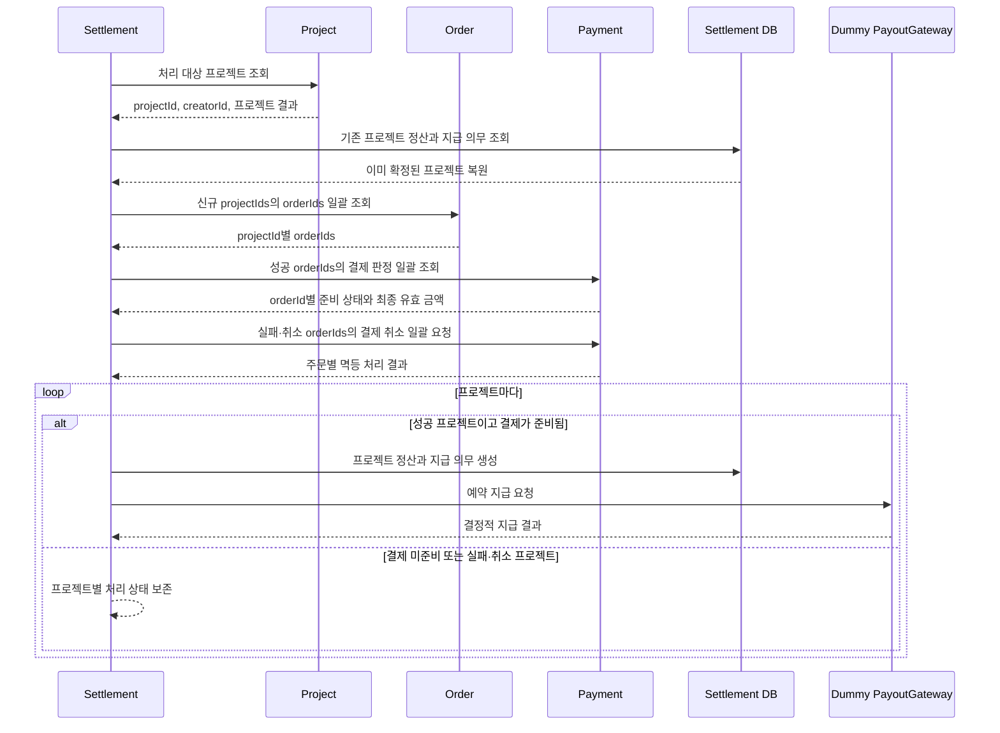

# Settlement service

성공한 프로젝트의 결제 금액을 프로젝트 단위로 확정해 창작자 지급을 관리하고, 실패하거나 취소된 프로젝트는 관련 결제의 취소를 Payment에 요청한다. Project와 Order가 각각 판정한 결과·귀속을 Settlement가 식별자로 연결하되 그 판단을 다시 수행하지 않는다.

## 목표 실행 흐름



- Project가 프로젝트 완료와 성공·실패·취소 결과를 판정한다.
- Settlement는 Project에서 받은 `projectId` 목록을 Order에 전달한다.
- 이미 확정된 프로젝트는 로컬 정산과 지급 의무를 먼저 복원해 Order·Payment 조회 대상에서 제외한다. 이후 `FAILED`·`CANCELLED`로 관찰되면 기존 정산을 유지하고 결과 전환 충돌로 처리한다.
- Order는 주문의 단일 프로젝트 귀속을 소유하고 `projectId`별 `orderId` 목록만 제공한다.
- Settlement는 Order에서 받은 `orderId` 목록으로 Payment의 결제 판정을 조회한다. Payment가 `projectId`를 전달받거나 보존할 필요는 없다.
- 성공 프로젝트는 준비 완료된 최종 유효 결제 금액으로 프로젝트 정산과 지급 의무를 생성한다.
- 실패·취소 프로젝트는 프로젝트 정산과 지급 의무를 만들지 않고, Order에서 받은 `orderId`로 Payment에 프로젝트 결제 취소를 요청한다. 전액 환불 필요 여부와 실행 결과는 Payment가 소유한다.
- Settlement는 결제·취소·환불 상태를 다시 판정하거나 결제 단위 정산 기록을 저장하지 않는다.
- 창작자 지급은 Payment가 아니라 Settlement의 `PayoutGateway` seam을 사용한다.

현재 도메인 언어와 경계의 기준은 작업공간의 [Settlement CONTEXT](../../CONTEXT.md), [ADR-0005](../../docs/adr/0005-orchestrate-project-order-payment-from-settlement.md)와 [내부 입력 계약](../../.scratch/project-settlement/cross-module-data-contracts.md)이다. ADR-0004는 이전 결정의 이력이며 ADR-0005로 대체됐다.

## 현재 구현 상태

| Seam | 현재 구현 | 목표 대비 상태 |
|---|---|---|
| 프로젝트 처리 대상 | Project HTTP adapter가 `SUCCEEDED`·`FAILED`·`CANCELLED`를 각각 조회해 상태 일치와 응답 내·상태 간 중복을 검증하고 `ProjectOutcomeReader`로 전달한다. dummy는 `SUCCEEDED`만 반환한다. | Project 결과 조회 계약 완료. 실패·취소 후속 처리는 이슈 14 범위 |
| 프로젝트별 주문 식별자 | `ProjectOrderReader`와 결정적 dummy가 모든 `projectIds → projectId별 orderIds`를 한 번에 제공하며, 실행 서비스가 누락·중복·예상 밖 프로젝트와 프로젝트 간 주문 중복을 거부한다. | 운영 Order HTTP adapter는 외부 제공 interface 확정 후 구현 필요 |
| 주문별 결제 판정 | `PaymentAssessmentReader`와 결정적 dummy가 성공 프로젝트의 `orderIds`만 받아 `READY·NOT_READY·NO_PAYMENT`를 반환한다. 미준비 프로젝트는 확정하지 않고 다른 프로젝트 처리를 계속한다. | 운영 Payment HTTP adapter는 외부 제공 interface 확정 후 구현 필요 |
| 프로젝트 정산 확정 | 프로젝트별 정산과 지급 의무를 한 DB 트랜잭션에서 생성한다. 재실행은 기존 정산·지급 의무를 외부 조회 전에 복원하며 성공 결과는 `SETTLEMENT_ALREADY_CONFIRMED`, 실패·취소 결과는 `OUTCOME_CONFLICT`로 반환한다. | 성공 정산 기준 재실행·전환 충돌 완료. 결제 취소 후 성공으로 바뀌는 역방향 충돌은 취소 명령 영속화 후 검증 필요 |
| 실패·취소 프로젝트 결제 취소 | 실행 서비스가 결제 판정 조회 없이 주문별 프로젝트 결과 사유와 결정적 멱등키로 `ProjectPaymentCancellationGateway`를 호출한다. dummy는 완료를 반환하고, 주문별 일곱 가지 결과는 프로젝트 처리 상태로 보수적으로 집약한다. | 운영 Payment HTTP adapter와 취소 명령 영속화는 후속 구현 필요 |
| 지급대행 | `PayoutGateway`가 있지만 현재 선택 가능한 실행 adapter는 opt-in 실제 Toss adapter뿐이다. 기본값에서는 지급 실행기가 비활성화된다. | 외부 네트워크 없는 결정적 dummy adapter로 교체 필요 |

현재 조합은 목표 E2E 흐름이 완성된 상태가 아니다. Settlement core의 성공 정산·미준비·실패·취소 분기와 Order·Payment·결제 취소 dummy는 마련됐지만, 운영 Order·Payment adapter, 취소 명령 영속화와 dummy 지급대행은 아직 없으므로 운영 준비 완료로 해석하지 않는다.

실제 Toss 자격 증명, 테스트 셀러, HTTP/JWE 호출, smoke test와 webhook은 활성 경로와 완료 조건에서 제외한다. `tossPayoutSmokeTest` Gradle 태스크와 Toss adapter 코드는 과거 계약 검증용으로 남아 있지만 기본 테스트·CI·목표 실행 흐름에서 사용하지 않는다.

## 로컬 검증

저장소 루트에서 Docker를 실행한 뒤 Settlement 테스트를 수행한다. MySQL 통합 테스트는 Testcontainers를 사용한다.

```shell
./gradlew :settlement-service:test
```

월 실행 HTTP 계약은 다음과 같다. 이 경로는 `ADMIN` role의 유효한 JWT가 필요하다.

```http
POST /internal/v1/settlements/runs
Authorization: Bearer <ADMIN_JWT>
Content-Type: application/json

{
  "settlementMonth": "2026-07"
}
```

`settlementMonth`는 월 실행 결과와 지급 예정일 계산에 사용하며 Project·Order·Payment의 조회·취소 조건으로 전달하지 않는다.

## 관련 설정

| 속성 | 현행 기본 의미 |
|---|---|
| `settlement.project-target.mode` | 미지정 시 `http`; 테스트에서 `dummy` 선택 가능 |
| `settlement.project-target.http.base-url` | 기본값 `http://project-service` |
| `settlement.project-target.http.connect-timeout` | 기본값 1초 |
| `settlement.project-target.http.read-timeout` | 기본값 3초 |
| `settlement.external-data.mode` | 미지정 시 Order 목록·Payment 판정·결제 취소 dummy와 dummy 지급 프로필 활성화 |
| `settlement.toss-payout.enabled` | 미지정 시 비활성; `true`는 목표에서 제외된 실제 Toss adapter를 활성화 |

Config server의 기존 값은 별도 승인 없이 변경하지 않는다. 후속 구현은 운영 Project·Order·Payment adapter와 dummy 지급 adapter가 역할별로 하나씩만 선택되도록 서비스 내부 조건을 먼저 완성해야 한다.

## 후속 문서·구현 동기화

1. [ADR-0005](../../docs/adr/0005-orchestrate-project-order-payment-from-settlement.md): Project → Order → Payment 조율과 직접 지급대행 결정
2. [이슈 11](../../.scratch/project-settlement/issues/11-expose-payment-inputs-by-order.md): Payment가 `orderId`로 최종 유효 결제 정보를 제공
3. [이슈 12](../../.scratch/project-settlement/issues/12-expose-order-project-payment-inputs.md): Order가 프로젝트별 `orderId` 목록을 제공
4. [이슈 13](../../.scratch/project-settlement/issues/13-expose-idempotent-payment-cancellation.md): Payment의 `orderId` 기반 멱등 프로젝트 결제 취소 명령 제공
5. [이슈 14](../../.scratch/project-settlement/issues/14-orchestrate-project-outcome-settlement.md): Settlement의 성공 정산과 실패·취소 결제 취소 오케스트레이션
6. [이슈 15](../../.scratch/project-settlement/issues/15-harden-project-settlement-internal-contracts.md): 내부 계약 인증·추적·오류·호환성 정비
7. [이슈 16](../../.scratch/project-settlement/issues/16-verify-project-outcome-flow-e2e.md): 전체 흐름 E2E와 운영 전환 검증
8. [이슈 17](../../.scratch/project-settlement/issues/17-automate-dummy-payout-reconciliation.md): 더미 지급 결과 진행과 재시도 자동화

이슈 05는 제공자 interface와 독립적으로 진행할 수 있고, 이슈 17의 직접 선행 조건이다. Config server 변경은 별도 승인 전까지 수행하지 않는다.
