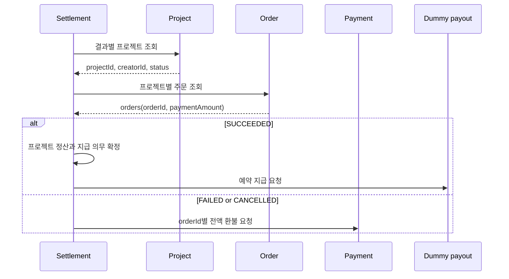

<!-- TODO(settlement-plan): 구현 완료 시 작업 예정 항목을 현재 동작으로 옮기고 완료된 계획은 삭제한다. -->
# Settlement Service

프로젝트 결과에 따라 성공 프로젝트의 **프로젝트 정산과 창작자 지급**을 관리하고, 실패·취소 프로젝트의 **결제 환불 요청**을 조율한다. 현재 구현은 HTTP 조회·명령을 사용하며, 아래 작업 예정에서 Kafka 입력과 프로젝트별 batch 환불 요청 구조로 전환한다.

Settlement는 다른 서비스의 판단을 대신하지 않는다.

- Project: `projectId`, `creatorId`, 결과(`SUCCEEDED`, `FAILED`, `CANCELLED`)
- Order: 프로젝트별 `orders(orderId, paymentAmount)`
- Payment: 실패·취소 주문의 전액 환불 필요 여부와 처리 결과
- Settlement: 성공 프로젝트의 금액 계산·확정, 지급 의무·지급 시도, 프로젝트 환불 요청

## 현재 처리 흐름



성공 정산 금액은 Payment가 아니라 Order의 주문 결제금액에서 계산한다. 현행 정책은 결제·정산 대행 수수료 4%, 플랫폼 수수료 4%, 각 수수료의 부가세 10%이며 공제액은 원 미만을 버린다.

재실행 시 이미 확정된 프로젝트 정산과 완료된 결제 취소를 재사용한다. 기존 결과와 새 Project 결과가 충돌하면 저장된 원본을 바꾸지 않고 `OUTCOME_CONFLICT`로 반환한다.

## 현재 구현 범위

- Project·Order·Payment 연동은 HTTP adapter와 테스트용 dummy adapter를 제공한다.
- 지급대행은 항상 결정적 dummy adapter를 사용하며 실제 송금은 발생하지 않는다.
- Payment adapter는 주문별 단건 환불 happy case를 지원한다. 제공자 멱등키, batch 요청, 부분 실패 복구, 실제 서비스 간 E2E는 아직 지원하지 않는다.
- 정산 실행은 현재 관리자용 동기 HTTP 요청이다. Kafka 입력 수집과 월 정산 실행은 아래 작업 예정이다.

## 작업 예정

아래 순서는 Kafka 입력 수집, PG 정산 대사, 창작자 지급과 프로젝트별 batch 환불 요청으로 전환하기 위한 구현 계획이다.

1. **Project·Order 이벤트 입력을 저장한다.**
   - `ProjectEnded`, `ProjectCancelled`에서 `projectId`, `creatorId`, 프로젝트 결과를 받는다.
   - `OrderPaymentCompleted`, `OrderPaymentCancelled`에서 `orderId`, `pgOrderId`, `projectId`, `paymentAmount`, 결제 결과를 받는다.
   - `orderId`는 Order 내부 식별자이고 `pgOrderId`는 상점이 결제 요청 때 생성한 Toss `orderId`다.

2. **Kafka consumer를 멱등하게 만든다.**
   - `eventId` 고유 Inbox와 Project·Order 입력 projection을 같은 DB 트랜잭션에 저장한다.
   - DB commit 뒤 Kafka offset을 commit하고, 반복 실패와 계약 오류는 DLT로 격리한다.

3. **토스 정산 조회 더미와 대사를 구현한다.**
   - 실제 `GET /v1/settlements`의 query와 `Settlement[]` 형식을 사용하되 네트워크 호출은 하지 않는다.
   - `soldDate` 기준 대상 월의 모든 페이지를 조회한다.
   - Order의 `pgOrderId`, `paymentAmount`를 Toss `Settlement.orderId`, `amount`와 비교한다. 프로젝트 정산 계산 금액은 계속 Order의 `paymentAmount`를 사용한다.

4. **불일치 재확인과 지급 차단을 구현한다.**
   - 최초 불일치에는 `pgOrderId`까지 반환하는 Order Feign 계약과 같은 조건의 토스 정산 조회를 각각 한 번 재호출한다.
   - 식별자 집합·금액·중복 불일치가 남으면 월 실행 전체를 `REVIEW_REQUIRED`로 종료하고 어떤 프로젝트도 새로 확정하거나 지급하지 않는다.

5. **자동·수동 월 실행을 하나의 use case로 연결한다.**
   - `Asia/Seoul` 기준 매월 5일에는 직전 달을 실행한다.
   - `POST /internal/v1/settlements/runs`는 요청한 `settlementMonth`를 실행한다.
   - 같은 월의 스케줄 실행과 API 호출은 하나의 멱등 실행으로 수렴한다.

6. **성공 프로젝트의 지급 의무를 확정하고 더미 지급대행을 호출한다.**
   - 대사를 통과한 `SUCCEEDED` 프로젝트의 주문 결제금액으로 프로젝트 정산과 지급 의무를 확정한다.
   - `creatorId`에 대응하는 Toss Seller `destination`을 사용한다.
   - 실제 Toss 지급대행의 복호화 후 요청·응답 필드를 사용하는 결정적 더미로 지급 결과를 기록하며 HTTP와 JWE 암복호화는 구현하지 않는다.

7. **실패·취소 프로젝트의 익일 batch 환불 요청을 발행한다.**
   - 프로젝트 결과 발생 다음 날 완료·미취소 결제 목록 전체를 프로젝트별 하나의 `ProjectRefundRequested` Outbox 이벤트로 발행한다.
   - 프로젝트 종료에 따른 일괄 환불 요청은 Settlement가 소유한다. 부분 목록이나 주문별 이벤트는 발행하지 않으며, 각 결제의 단건 환불 판단·실행은 Payment가 소유한다.

8. **producer·consumer 신뢰성과 계약 E2E를 확인한다.**
   - Project·Order·Settlement producer는 도메인 변경과 Outbox를 같은 로컬 트랜잭션에 저장하고 Kafka ACK 뒤 발행 완료로 표시한다.
   - 중복 전달, 재시도, DLT, 스케줄·API 동시 실행, Order 재조회와 batch 환불 consumer까지 제공자·소비자 계약을 검증한다.

Project·Order producer와 Payment batch 환불 consumer는 각 제공 모듈의 선행 작업이다. Settlement 작업에서는 다른 서비스 DB를 직접 조회하거나 Payment의 환불 상태를 대신 판정하지 않는다. 실제 Toss 네트워크 연동과 Config Server 변경도 이번 범위에서 제외한다.

## 실행과 테스트

Java 21과 Docker가 필요하다. 저장소 루트에서 테스트한다. DB 통합 테스트는 Testcontainers MySQL을 사용한다.

```shell
./gradlew :settlement-service:test
```

애플리케이션 실행에는 Config Server, Eureka, MySQL이 필요하다. 운영 adapter를 사용할 때는 Project, Order, Payment도 실행한다. 전체 기동 순서는 [루트 README](../README.md)를 따른다.

```shell
./gradlew :settlement-service:bootRun
```

외부 서비스 없이 입력 adapter를 확인하려면 Project·Order·Payment만 dummy로 바꿀 수 있다. DB와 공통 인프라는 여전히 필요하다.

```shell
./gradlew :settlement-service:bootRun --args='--settlement.project-target.mode=dummy --settlement.project-order.mode=dummy --settlement.payment-cancellation.mode=dummy'
```

dummy 입력은 성공 프로젝트 1건과 100,000원 주문 1건을 제공한다. 지급 결과의 기본값은 `COMPLETED`다.

## API

| Method | Path | 권한 | 설명 |
|---|---|---|---|
| `POST` | `/internal/v1/settlements/runs` | `ADMIN` | 프로젝트 결과를 조회해 정산 또는 결제 취소 실행 |
| `GET` | `/api/v1/settlements` | `CREATOR` | 로그인한 창작자의 프로젝트 정산 내역 목록 |
| `GET` | `/api/v1/settlements/{settlementId}` | `CREATOR` | 로그인한 창작자의 프로젝트 정산 상세 |
| `GET` | `/api/v1/settlements/all` | `ADMIN` | 전체 프로젝트 정산 내역 목록 |
| `GET` | `/api/v1/settlements/all/{settlementId}` | `ADMIN` | 프로젝트 정산 상세와 지급 시도 목록 |

인증·인가는 Gateway가 담당하고 Settlement는 전달된 사용자 식별자를 신뢰한다. 월 실행 요청은 내부 API다.

```http
POST /internal/v1/settlements/runs
Content-Type: application/json

{
  "settlementMonth": "2026-07"
}
```

외부 조회 API는 게이트웨이 `http://localhost:8000`을 통해 호출한다. Swagger UI는 전체 스택 실행 후 `http://localhost:8000/settlement-service/swagger-ui.html`에서 확인할 수 있다.

## 설정

| 속성 | 기본값 | 설명 |
|---|---|---|
| `settlement.project-target.mode` | `http` | `http` 또는 `dummy` |
| `settlement.project-target.http.base-url` | `http://project-service` | Project 서비스 주소 |
| `settlement.project-order.mode` | `http` | `http` 또는 `dummy` |
| `settlement.project-order.http.base-url` | `http://order-service` | Order 서비스 주소 |
| `settlement.payment-cancellation.mode` | `http` | `http` 또는 `dummy` |
| `settlement.payment-cancellation.http.base-url` | `http://payment-service` | Payment 서비스 주소 |
| `settlement.external-data.mode` | `dummy` | dummy 창작자 지급 프로필 초기화 여부 |
| `settlement.dummy-payout.scenario` | `COMPLETED` | dummy 지급 결과 시나리오 |

세 HTTP adapter의 기본 연결 제한시간은 1초, 응답 제한시간은 3초다. 지급 시나리오는 `COMPLETED`, `REQUESTED`, `IN_PROGRESS`, `RETRYABLE_FAILED`, `NON_RETRYABLE_FAILED`, `UNKNOWN`을 지원한다.

Config Server 설정은 이 모듈의 요청 범위가 아니므로 여기서 변경하지 않는다.

## 패키지 구조

```text
settlement
├── presentation     HTTP API, DTO, 오류 응답
├── application      유스케이스와 외부 통신 port
├── domain           도메인 모델과 repository interface
└── infrastructure   HTTP·dummy adapter, JPA 구현, 기술 설정
```

의존 방향은 `presentation → application → domain`이며 infrastructure가 application port와 domain repository를 구현한다.
