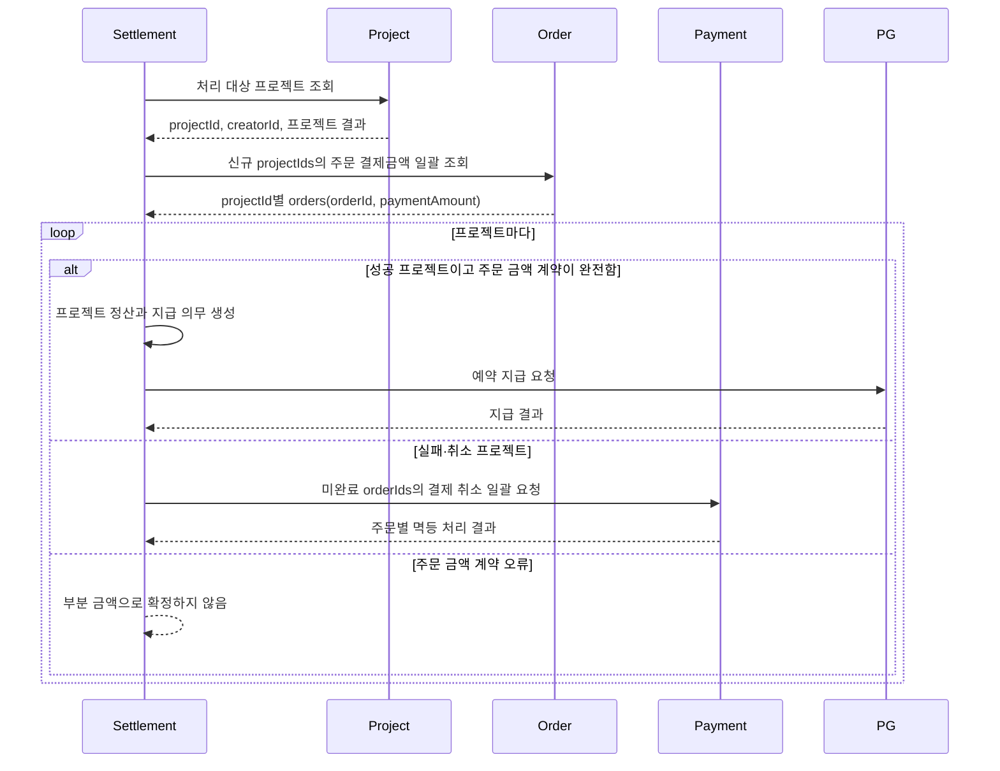

# Settlement service

성공한 프로젝트의 결제 금액을 프로젝트 단위로 확정해 창작자 지급을 관리하고, 실패하거나 취소된 프로젝트는 관련 결제의 취소를 Payment에 요청한다. Project와 Order가 각각 판정한 결과·귀속을 Settlement가 식별자로 연결하되 그 판단을 다시 수행하지 않는다.

## 목표 실행 흐름



- Project가 프로젝트 완료와 성공·실패·취소 결과를 판정한다.
- Settlement는 Project에서 받은 `projectId` 목록을 Order에 전달한다.
- 이미 확정된 프로젝트는 로컬 정산과 지급 의무를 먼저 복원해 Order 조회 대상에서 제외한다. 이후 `FAILED`·`CANCELLED`로 관찰되면 기존 정산을 유지하고 결과 전환 충돌로 처리한다.
- Order는 주문의 단일 프로젝트 귀속과 주문별 `paymentAmount`를 소유하고 `projectId`별 `orderId`, `paymentAmount` 목록을 제공한다.
- 성공 프로젝트는 Order가 제공한 주문별 결제금액으로 프로젝트 정산과 지급 의무를 생성하며 Payment에 금액이나 준비 상태를 조회하지 않는다.
- 실패·취소 프로젝트는 프로젝트 정산과 지급 의무를 만들지 않고, Order에서 받은 `orderId`로 Payment에 프로젝트 결제 취소를 요청한다. 전액 환불 필요 여부와 실행 결과는 Payment가 소유한다.
- Settlement는 Payment 호출 전에 주문별 `projectId`·`orderId`·프로젝트 결과 사유·멱등키를 저장하고 호출 뒤 마지막 관찰 결과를 반영한다. 완료·no-op·최종 실패는 재호출하지 않고 나머지는 같은 멱등키로 재개한다.
- Settlement는 결제·취소·환불 상태를 다시 판정하거나 결제 단위 정산 원장을 저장하지 않는다. 결제 취소 명령 기록은 재실행을 위한 최소 오케스트레이션 정보다.
- 창작자 지급은 Payment를 거치지 않고 Settlement가 PG에 직접 지급대행을 요청한다.

현재 도메인 언어와 경계의 기준은 작업공간의 [Settlement CONTEXT](../../CONTEXT.md), [ADR-0006](../../docs/adr/0006-source-project-settlement-amounts-from-order.md)과 [내부 입력 계약](../../.scratch/project-settlement/cross-module-data-contracts.md)이다. ADR-0005의 성공 프로젝트 Payment 조회 결정은 ADR-0006으로 대체됐다.

## 현재 구현 상태

| Seam | 현재 구현 | 목표 대비 상태 |
|---|---|---|
| 프로젝트 처리 대상 | Project HTTP adapter가 `SUCCEEDED`·`FAILED`·`CANCELLED`를 각각 조회해 상태 일치와 응답 내·상태 간 중복을 검증하고 `ProjectOutcomeReader`로 전달한다. dummy는 `SUCCEEDED`만 반환한다. | Project 결과 조회와 결과별 분기 완료 |
| 프로젝트별 주문 결제금액 | `ProjectOrderReader`가 `projectId별 orders(orderId, paymentAmount)`를 제공한다. 요청 프로젝트의 누락·중복·예상 밖 결과, 전역 주문 중복과 성공 프로젝트의 빈 목록·0원 합계를 정산 전에 거부한다. dummy도 같은 port를 사용한다. | Settlement 소비 계약 완료. 운영 Order HTTP adapter는 외부 제공 interface 구현 후 연결 필요 |
| 성공 정산 금액 입력 | 성공 프로젝트는 Order의 주문별 `paymentAmount`를 직접 계산 정책에 전달한다. Payment에는 금액이나 준비 상태를 조회하지 않는다. | Order 금액 소비 전환 완료 |
| 프로젝트 정산 확정 | 프로젝트별 정산과 지급 의무를 한 DB 트랜잭션에서 생성한다. 재실행은 기존 정산·지급 의무를 외부 조회 전에 복원하며 성공 결과는 `SETTLEMENT_ALREADY_CONFIRMED`, 실패·취소 결과는 `OUTCOME_CONFLICT`로 반환한다. 저장된 결제 취소 명령 뒤 성공으로 바뀌는 역방향 전환도 충돌로 차단한다. | 성공 정산과 양방향 결과 전환 충돌 검증 완료 |
| 실패·취소 프로젝트 결제 취소 | 실행 서비스가 Order에서 받은 `orderId`로 주문별 명령을 선저장한 뒤 결정적 멱등키로 `ProjectPaymentCancellationGateway`를 호출한다. 주문별 마지막 관찰 결과를 보존해 완료·no-op·최종 실패는 건너뛰고 미완료만 같은 키로 재개하며, 일곱 가지 결과를 프로젝트 처리 상태로 보수적으로 집약한다. | Settlement 영속화·재실행 완료. 운영 Payment HTTP adapter는 외부 제공 interface 확정 후 구현 필요 |
| 지급대행 | `PayoutGateway` 포트를 구현한 결정적 dummy adapter가 항상 등록된다. 기본값은 `COMPLETED`이고 같은 멱등키는 같은 지급 식별자와 결과로 수렴한다. | 실제 송금 없이 예약 지급 흐름 실행 가능 |

Settlement core는 Order 주문별 결제금액을 소비해 성공 정산과 실패·취소 결제 취소로 분기한다. 목표 E2E 흐름을 완성하려면 이슈 12의 운영 Order 조회 adapter와 이슈 13의 운영 Payment 취소 adapter를 연결해야 한다.

실제 PG HTTP 연동, 자격 증명, 암호화 요청, smoke test와 webhook 구현은 제거했다. 지급 요청은 애플리케이션의 기존 선저장·결과 반영 트랜잭션 흐름을 그대로 지나지만 외부 네트워크나 실제 송금은 발생하지 않는다. 서비스 시작 로그에도 더미 지급대행임을 명시한다.

## 로컬 검증

저장소 루트에서 Docker를 실행한 뒤 Settlement 테스트를 수행한다. MySQL 통합 테스트는 Testcontainers를 사용한다.

```shell
./gradlew :settlement-service:test
```

월 실행 HTTP 계약은 다음과 같다. 이 경로는 `ADMIN` role의 유효한 JWT가 필요하다.

```http
POST /internal/v1/settlements/runs
Authorization: Bearer <ADMIN_JWT>
Content-Type: application/json

{
  "settlementMonth": "2026-07"
}
```

`settlementMonth`는 월 실행 결과와 지급 예정일 계산에 사용하며 Project·Order·Payment의 조회·취소 조건으로 전달하지 않는다.

## 관련 설정

| 속성 | 현행 기본 의미 |
|---|---|
| `settlement.project-target.mode` | 미지정 시 `http`; 테스트에서 `dummy` 선택 가능 |
| `settlement.project-target.http.base-url` | 기본값 `http://project-service` |
| `settlement.project-target.http.connect-timeout` | 기본값 1초 |
| `settlement.project-target.http.read-timeout` | 기본값 3초 |
| `settlement.external-data.mode` | 미지정 시 Order 조회·Payment 취소 dummy와 dummy 지급 프로필 활성화 |
| `settlement.dummy-payout.scenario` | 미지정 시 `COMPLETED`; 로컬·테스트에서 `REQUESTED`, `IN_PROGRESS`, `RETRYABLE_FAILED`, `NON_RETRYABLE_FAILED`, `UNKNOWN` 선택 가능 |

Config server의 기존 값은 변경하지 않는다. 외부 요청자가 더미 지급 결과를 조작하는 공개 API는 제공하지 않으며 시나리오 설정은 로컬 실행과 테스트 seam으로만 사용한다.

## 후속 문서·구현 동기화

1. [ADR-0006](../../docs/adr/0006-source-project-settlement-amounts-from-order.md): Order가 프로젝트별 주문 결제금액을 제공
2. [이슈 11](../../.scratch/project-settlement/issues/11-expose-payment-inputs-by-order.md): superseded된 Payment 금액 조회 이력
3. [이슈 12](../../.scratch/project-settlement/issues/12-expose-order-project-payment-inputs.md): Order가 프로젝트별 `orderId`, `paymentAmount` 목록을 제공
4. [이슈 13](../../.scratch/project-settlement/issues/13-expose-idempotent-payment-cancellation.md): Payment의 `orderId` 기반 멱등 프로젝트 결제 취소 명령 제공
5. [이슈 14](../../.scratch/project-settlement/issues/14-orchestrate-project-outcome-settlement.md): Settlement의 성공 정산과 실패·취소 결제 취소 오케스트레이션
6. [이슈 15](../../.scratch/project-settlement/issues/15-harden-project-settlement-internal-contracts.md): 내부 계약 인증·추적·오류·호환성 정비
7. [이슈 16](../../.scratch/project-settlement/issues/16-verify-project-outcome-flow-e2e.md): 전체 흐름 E2E와 운영 전환 검증
8. [이슈 17](../../.scratch/project-settlement/issues/17-automate-dummy-payout-reconciliation.md): 더미 지급 결과 진행과 재시도 자동화

이슈 05의 더미 지급대행이 완료되어 이슈 17의 선행 조건이 해소됐다. Config server 변경은 별도 승인 전까지 수행하지 않는다.
