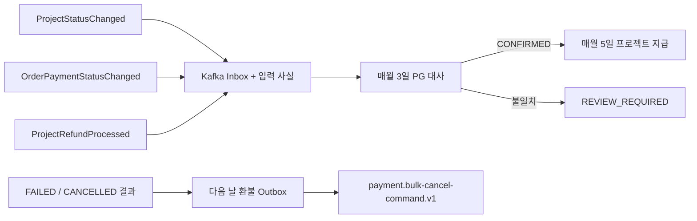

# Settlement Service

> 구현 기준일: 2026-08-23. 이 문서는 현재 `settlement-service` 코드의 실행 스냅샷이다. 목표 계약과 용어는 루트 [`CONTEXT.md`](../../CONTEXT.md), [`ADR-0007`](../../docs/adr/0007-run-project-settlement-from-kafka-facts-and-pg-reconciliation.md), [이벤트·대사 계약](../../.scratch/project-settlement/cross-module-data-contracts.md)을 우선한다.

Settlement는 Kafka로 수집한 프로젝트 결과와 주문 결제 사실을 보존한다. 매월 PG 정산을 대사하고, 대사가 완료된 성공 프로젝트만 정산·지급하며, 실패·취소 프로젝트는 다음 날 하나의 batch 환불 요청을 발행한다. 실제 Toss 호출은 하지 않으며 정산 조회와 지급대행은 결정적 dummy adapter다.

## 현재 실행 흐름



- PG 대사는 `soldDate` 기준 직전 달의 완료·미취소 결제를 `pgOrderId`와 `paymentAmount`로 비교한다. 최초 불일치에는 Order 재확인과 Toss 재조회가 각각 한 번 수행된다.
- 프로젝트 지급은 성공 프로젝트의 전체 유효 결제가 모두 `CONFIRMED`일 때만 수행한다. 결제 월 필터나 Toss 조회를 다시 하지 않는다.
- 지급 프로필이 준비되지 않아도 프로젝트 정산 원본은 확정할 수 있지만 지급 의무는 만들지 않는다. 프로필 등록 뒤 같은 프로젝트 지급 실행에서 의무를 만든다.
- 재시도 가능한 지급 실패도 최대 네 번까지만 재시도하며, 이후와 재시도 불가 실패는 `ACTION_REQUIRED`로 남긴다.
- 환불 Outbox는 결과 시각 이전에 완료되고 취소되지 않은 프로젝트 결제 전체가 있을 때만 생성된다. 입력이 불완전하거나 결제가 없으면 생성하지 않는다.

## 실행 진입점

| 구분 | 기본 시각(Asia/Seoul) | 대상 | 수동 API |
|---|---|---|---|
| PG 대사 | 매월 3일 00:00 | 직전 달 | `POST /api/v1/settlements/pg-reconciliations/runs` |
| 프로젝트 지급 | 매월 5일 00:00 | 실행 월 | `POST /api/v1/settlements/project-payouts/runs` |
| 환불 Outbox 생성 | 매일 00:05 | 전날까지 발생한 결과 | 없음 |
| 환불 Outbox 발행 | 60초마다 | 미발행 요청 | 없음 |

수동 실행 요청은 각각 `{ "settlementMonth": "2026-07" }`, `{ "payoutMonth": "2026-08" }` 형식이다. 실제 공개 경로와 조회 응답은 [Settlement API 명세](../../docs/settlement-api-spec.md)를 따른다.

## Kafka 계약과 신뢰성

| Topic | Settlement 역할 | Key |
|---|---|---|
| `project.status-changed.v1` | `ProjectStatusChanged` 소비 | `projectId` |
| `order.payment-status-changed.v1` | `OrderPaymentStatusChanged` 소비 | `orderId` |
| `payment.bulk-cancel-command.v1` | `ProjectRefundRequested` 발행 | `refundRequestId` |
| `payment.bulk-cancel-result.v1` | `ProjectRefundProcessed` 소비 | `refundRequestId` |

consumer는 `eventId` Inbox 저장과 projection 갱신을 같은 트랜잭션으로 처리한 뒤 수동 ACK한다. 지원하지 않는 envelope·payload 또는 중복되지 않는 사실 충돌은 listener 오류로 남아 공통 Kafka 오류 처리로 넘긴다. Outbox publisher는 Kafka ACK 후에만 발행 완료 시각을 기록한다.

Project·Order producer와 Payment의 batch consumer/결과 producer는 이 서비스 외부 선행조건이다. PG 대사 불일치 때만 Order의 결제를 한 번 재확인하며, 프로젝트 결과는 동기 HTTP로 조회하지 않는다. Settlement는 다른 서비스 DB를 조회하거나 Payment의 단건 환불 판단을 대신하지 않는다.

## 금액과 지급

프로젝트 정산 기준 금액은 Order의 `paymentAmount` 합계이며 0원일 수 없다. 결제·정산 대행 수수료 4%, 플랫폼 수수료 4%, 각 수수료 부가세 10%를 원 미만 절사해 공제한다. PG의 `amount`, `payOutAmount`는 대사에만 사용한다.

지급은 실제 송금 없는 `DummyPayoutGateway`를 사용한다. 기본 시나리오는 `COMPLETED`이며 `REQUESTED`, `IN_PROGRESS`, `RETRYABLE_FAILED`, `NON_RETRYABLE_FAILED`, `UNKNOWN`도 설정할 수 있다.

## 실행과 설정

Java 21과 Docker가 필요하다. 테스트는 Testcontainers MySQL을 사용한다. 애플리케이션 기동에는 Config Server, Eureka, MySQL이 필요하다.

```shell
./gradlew :settlement-service:test
./gradlew :settlement-service:bootRun
```

| 속성 | 기본값 |
|---|---|
| `settlement.pg-reconciliation.cron` | `0 0 0 3 * *` |
| `settlement.project-payout.cron` | `0 0 0 5 * *` |
| `settlement.refund-outbox.create-cron` | `0 5 0 * * *` |
| `settlement.refund-outbox.publish-fixed-delay` | `60000` |
| `settlement.dummy-payout.scenario` | `COMPLETED` |
| `settlement.project-order.http.connect-timeout` | `1s` |
| `settlement.project-order.http.read-timeout` | `3s` |

Config Server의 기존 설정은 이 문서 갱신 범위에서 변경하지 않았다.
